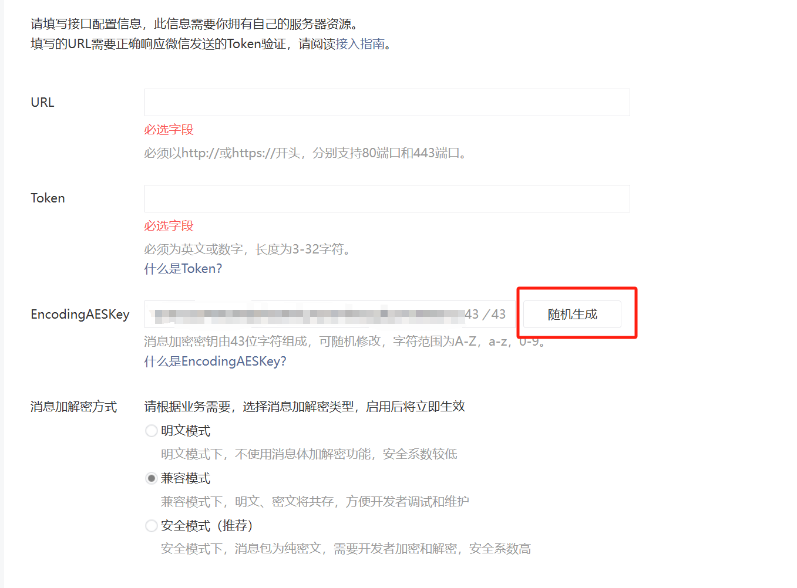

# 前言


通过接入`DeepSeek`的`Api`接口到我们自己的公众号聊天平台，形成一个`Bot`聊天交互。通过`chatgpt-on-wechat`项目做中间的转发。一开始我参考的文章[DeepSeek接入微信公众号小白保姆教程](https://blog.csdn.net/m0_46272767/article/details/145385952)
注意：
- 这部分的搭建需要投入一些成本至于高低看自己的预算，机器不需要特别好的。
- 这个有没有封号的风险，我现在试了一个多月还没什么问题，我估摸着微信应该是对那种频繁使用的做警告处理，所以不用特别担心。
- 这个COW项目需要Python语言，大部分的报错异常都和Python有关系，多注意报错异常信息处理标题。


# 准备工作


准备工作这部分我不会写的特别细，有问题可以在评论区提醒我即可，主要都是一些选型和选产品的方向，这个就因人而异了。没有对错自己用的舒服看着舒服就行。

## 服务器

服务器可以选用国内的[阿里云](https://account.aliyun.com/)、[百度云](https://cloud.baidu.com/product/bcc.html)、[青云](https://www.qingcloud.com/consultation)、[华为云](https://www.huaweicloud.com/)、[腾讯云](https://cloud.tencent.com/)、[莱卡云](https://www.lcayun.com/)，国外的服务器也可以这个看自己选择，服务器选型就用`2核2G`因为`COW`也没有说要多少内存核数跑服务，所以`2核2G`这个我感觉完全够用了，大概一个月`20-30rmb`当然也有免费的云服务器额度，这个可以去看看`华为云`和`阿里云`好像有免费额度，我这里选的是`莱卡云`的服务因为之前买过就用的之前的服务器，服务器地区无所谓哪里都可以。

建议买服务器的时候多关注这类字眼什么`最新活动`、`学生优惠`、`开发者优惠`等等，能便宜不少钱。挑好了就点击去购买界面，下面这台好像涨价了，一个月之前这个是30来着。


主要修改操作系统就可以，其他按默认就可以，其他平台也是一样，主要是操作系统要选择`CentOS 7.9`，这个版本稳定性好点，没那多的事情。

购买之后，就可以去到自己的控制台，看看自己的服务器初始化成功了没有。


点击主机行数据


保存这些信息即可


在你本地机器打开命令行终端，输入`ssh root@ip地址`进入你的服务器


输入密码即可


<h2 id="python_title">安装Python</h2>


由于COW项目建议Python版本是在 3.7.1~3.9.X 之间，推荐3.8版本。



操作命令如下：
```shell
#最好用python 3.8版本
#更新系统
sudo yum update -y
#安装编译依赖
sudo yum groupinstall "Development Tools" -y
sudo yum install gcc make wget zlib-devel bzip2 bzip2-devel readline-devel sqlite sqlite-devel openssl-devel xz xz-devel libffi-devel -y
#下载 Python 3.8 源码
cd /usr/src
sudo wget https://www.python.org/ftp/python/3.8.16/Python-3.8.16.tgz
sudo tar xzf Python-3.8.16.tgz
cd Python-3.8.16
# 编译并安装
sudo ./configure --enable-optimizations
sudo make altinstall
#验证
python3.8 --version
# pip设置
python3.8 -m ensurepip --upgrade
#升级最新
python3.8 -m pip install --upgrade pip
#添加环境变量
vi ~/.bashrc
#最后一行追加
export PATH=/usr/local/bin:$PATH
#加载变量
source ~/.bashrc
#验证pip
pip3.8 --version
```
## DeepSeek-Api服务


现在市面上的Api平台供应商有很多，具体如下：
[星辰Maas](https://training.xfyun.cn/modelSquare)
[秘塔搜索](https://metaso.cn)
[360纳米AI搜索](https://www.n.cn/)
[硅基流动](https://cloud.siliconflow.cn/)
[字节跳动火山引擎](https://console.volcengine.com/ark/region:ark+cn-beijing/experience)
[百度云千帆](https://console.bce.baidu.com/qianfan/modelcenter/model/buildIn/list)
[阿里云百炼](https://api.together.ai/playground/chat/deepseek-ai/DeepSeek-R1)
[Chutes](https://chutes.ai/app/chute/)
[Groq](https://groq.com/)
[Fireworks](https://fireworks.ai/models/fireworks/deepseek-r1)
[英伟达NIM](https://build.nvidia.com/deepseek-ai/deepseek-r1)
<font color="#ff0000">注意，下面这部分需要梯子</font>
[Cursor](https://cursor.sh/)
[Monica](https://monica.im)
[Lambda](https://lambdalabs.com/)
[Cerebras](https://cerebras.ai)
[Perplexity](https://www.perplexity.ai)
[Github](https://github.com/marketplace/models/azureml-deepseek/DeepSeek-R1/playground)
[POE](https://poe.com/DeepSeek-R1)


我使用的是第一个`星辰Maas`的Api服务，主要是我在上个月使用那会星辰刚出来DeepSeek服务，提供了一个月的免费试用，现在也是可以一直用就是限制了一天的使用token，我感觉用免费的就够用了，一天花不了这么多。


申请下来的就保存上面几个方框的信息，一个是提供给你的接口地址、一个是APIKey信息，一个是serviceId，保存这三份信息即可。

## 微信公众号

前往[微信公众号](https://mp.weixin.qq.com/)，用你的微信号注册一个公众号信息，[注册流程](https://mp.weixin.qq.com/s?__biz=MzI0NDQ4NzI5Nw==&mid=2247489646&idx=1&sn=b92881ff0a1f7d86911a685fe90780b8&chksm=e81bf439be5be674c15d2f1d96324280a32f472f7f079d7959d36193a04fb8a82506baf871da&scene=27)，之后点击`开发接口管理`进入。


进入开发接口管理，先保存最上方的AppID信息


点击修改配置


点击右侧的随机生成，复制生成出来的这串字符串，这个`AESKey`非常重要一定要保存好。之后这个窗口就不用动了，放着就行，如果你一天没完成的话那就保存这个`AESKey`就行其他的可以都关掉。


# 整合COW项目


整个流程很简单，就是拉取项目，修改配置，启动项目，如果有报错就解决报错，报错信息一定一定要去看我的异常信息处理，别着急肯定有解决办法，大不了就把服务器重装系统再来一次。
[COW项目地址](https://github.com/zhayujie/chatgpt-on-wechat)


## 拉取COW

```shell
#如果你的服务器没有Git 就安装一个
#安装git服务
sudo yum update -y
sudo yum install -y git
#安装wget服务
sudo yum install -y wget

# 在根目录下新建一个文件夹
cd /
mkdir servce
# 进入servce目录
cd servce
#git 拉取chatgpt-on-wechat
git clone https://github.com/zhayujie/chatgpt-on-wechat.git

#进入项目
cd /servce/chatgpt-on-wechat/
# 如果执行下面两个命令有报错，就去异常信息处理看看解决方案
#安装依赖
pip3 install -r requirements.txt
#扩展依赖
pip3 install -r requirements-optional.txt

```

## 修改配置

在服务器进入目录`cd /servce/chatgpt-on-wechat`，在执行`ll`检查目录下有一个`config-template.json`配置文件，配置内容如下：
```json
# config.json文件内容示例
{
  "model": "gpt-3.5-turbo",                                   # 模型名称, 支持 gpt-3.5-turbo, gpt-4, gpt-4-turbo, wenxin, xunfei, glm-4, claude-3-haiku, moonshot
  "open_ai_api_key": "YOUR API KEY",                          # 如果使用openAI模型则填入上面创建的 OpenAI API KEY
  "open_ai_api_base": "https://api.openai.com/v1",            # OpenAI接口代理地址
  "proxy": "",                                                # 代理客户端的ip和端口，国内环境开启代理的需要填写该项，如 "127.0.0.1:7890"
  "single_chat_prefix": ["bot", "@bot"],                      # 私聊时文本需要包含该前缀才能触发机器人回复
  "single_chat_reply_prefix": "[bot] ",                       # 私聊时自动回复的前缀，用于区分真人
  "group_chat_prefix": ["@bot"],                              # 群聊时包含该前缀则会触发机器人回复
  "group_name_white_list": ["ChatGPT测试群", "ChatGPT测试群2"], # 开启自动回复的群名称列表
  "group_chat_in_one_session": ["ChatGPT测试群"],              # 支持会话上下文共享的群名称  
  "image_create_prefix": ["画", "看", "找"],                   # 开启图片回复的前缀
  "conversation_max_tokens": 1000,                            # 支持上下文记忆的最多字符数
  "speech_recognition": false,                                # 是否开启语音识别
  "group_speech_recognition": false,                          # 是否开启群组语音识别
  "voice_reply_voice": false,                                 # 是否使用语音回复语音
  "character_desc": "你是基于大语言模型的AI智能助手，旨在回答并解决人们的任何问题，并且可以使用多种语言与人交流。",  # 人格描述
  # 订阅消息，公众号和企业微信channel中请填写，当被订阅时会自动回复，可使用特殊占位符。目前支持的占位符有{trigger_prefix}，在程序中它会自动替换成bot的触发词。
  "subscribe_msg": "感谢您的关注！\n这里是ChatGPT，可以自由对话。\n支持语音对话。\n支持图片输出，画字开头的消息将按要求创作图片。\n支持角色扮演和文字冒险等丰富插件。\n输入{trigger_prefix}#help 查看详细指令。",
  "use_linkai": false,                                        # 是否使用LinkAI接口，默认关闭，开启后可国内访问，使用知识库和MJ
  "linkai_api_key": "",                                       # LinkAI Api Key
  "linkai_app_code": ""                                       # LinkAI 应用或工作流code
}
```

需要改动的地方比较少，但是要准备好这些信息
```json
{
  "channel_type": "wechatmp", //默认就是wechatmp
  "model": "你的模型id，Api平台提供给你的serviceId",
  "open_ai_api_key": "你获取的DeepSeek的APIkey",
  "open_ai_api_base": "Api平台提供给你的接口地址",
  "single_chat_prefix": [""],
  "single_chat_reply_prefix": "",

  "wechatmp_app_id": "你的微信开发者ID，即APPID",
  "wechatmp_app_secret": "你的微信开发者密钥，即APP Secret",
  "wechatmp_aes_key": "前面随机生成的43位AESKey",
  "wechatmp_token": "这里可以自定义10-16位字符，但是要记住",
  "wechatmp_port": 80,

  "conversation_max_tokens": 3000,
  "expires_in_seconds": 3600,
  "character_desc": "你是基于大语言模型的AI智能助手，旨在回答并解决人们的任何问题，并且可以使用多种语言与人交流。",
  "temperature": 0.8,
  "subscribe_msg": "感谢您的关注！\n公众号已接入DeepSeek-V3，可以自由对话。\n受微信限制，较长的输出会先回复一句【正在思考中】，等待片刻后发送任意文字即可获取输出。",
  "use_linkai": false
}
```

准备好上面这些信息之后，执行以下命令
```shell
# 进入目录
cd /servce/chatgpt-on-wechat
# 复制一份config-template.json
cp config-template.json config.json
# 编辑config.json文件 之后点击按键i 写入动作 
# 把上面准备的json文件内容复制到config.json之后按键esc->冒号:->wq保存就好了
vi config.json
```

## 启动

```shell
# 进入目录
cd /servce/chatgpt-on-wechat
# 执行app.py文件
sudo python3 app.py
```

看到下面这些输出就是正常启动，启动有报错信息前往异常信息处理看看解决方案。


## 异常信息处理

### Could not find a version that satisfies the requirement


完整报错信息:
```txt
ERROR: Could not find a version that satisfies the requirement openai==0.27.8 (from versions: 0.0.2, 0.1.0, 0.1.1, 0.1.2, 0.1.3, 0.2.0, 0.2.1, 0.2.3, 0.2.4, 0.2.5, 0.2.6, 0.3.0, 0.4.0, 0.6.0, 0.6.1, 0.6.2, 0.6.3, 0.6.4, 0.7.0, 0.8.0, 0.9.0, 0.9.1, 0.9.2, 0.9.3, 0.9.4, 0.10.0, 0.10.1, 0.10.2, 0.10.3, 0.10.4, 0.10.5)  
ERROR: No matching distribution found for openai==0.27.8
```
这个问题是因为你的Python版本太低造成的，如果用默认的Python版本例如：2.x的版本就是会出现这个问题，所以建议用Python版本一定要用3.8版本。具体去到这篇文章的[安装Python标题](#python_title)。

### Traceback (most recent call last)


完整报错信息:
```txt
ERROR: Exception:
Traceback (most recent call last):
  File "/usr/local/python38/lib/python3.8/site-packages/pip/_internal/cli/base_command.py", line 188, in main
    status = self.run(options, args)
  File "/usr/local/python38/lib/python3.8/site-packages/pip/_internal/commands/install.py", line 345, in run
    resolver.resolve(requirement_set)
  File "/usr/local/python38/lib/python3.8/site-packages/pip/_internal/legacy_resolve.py", line 196, in resolve
    self._resolve_one(requirement_set, req)
  File "/usr/local/python38/lib/python3.8/site-packages/pip/_internal/legacy_resolve.py", line 359, in _resolve_one
    abstract_dist = self._get_abstract_dist_for(req_to_install)
  File "/usr/local/python38/lib/python3.8/site-packages/pip/_internal/legacy_resolve.py", line 305, in _get_abstract_dist_for
    abstract_dist = self.preparer.prepare_linked_requirement(
  File "/usr/local/python38/lib/python3.8/site-packages/pip/_internal/operations/prepare.py", line 214, in prepare_linked_requirement
    abstract_dist.prepare_distribution_metadata(
  File "/usr/local/python38/lib/python3.8/site-packages/pip/_internal/distributions/source.py", line 70, in prepare_distribution_metadata
    reqs = self.req.pep517_backend.get_requires_for_build_wheel()
  File "/usr/local/python38/lib/python3.8/site-packages/pip/_vendor/pep517/wrappers.py", line 70, in get_requires_for_build_wheel
    return self._call_hook('get_requires_for_build_wheel', {
  File "/usr/local/python38/lib/python3.8/site-packages/pip/_vendor/pep517/wrappers.py", line 162, in _call_hook
    raise BackendUnavailable
pip._vendor.pep517.wrappers.BackendUnavailable
WARNING: You are using pip version 19.2.3, however version 25.0.1 is available.
You should consider upgrading via the 'pip install --upgrade pip' command.
```

解决办法：
```shell
# 优先升级pip到最新版
python3.8 -m pip install --upgrade pip
# 安装必要的构建工具
python3.8 -m pip install --user --upgrade setuptools wheel
```



### urllib3 v2 only supports OpenSSL 1.1.1+


完整报错信息:
```txt
urllib3 v2 only supports OpenSSL 1.1.1+, currently the 'ssl' module is compiled with 'OpenSSL 1.0.2k-fips 26 Jan 2017'. See: https://github.com/urllib3/urllib3/issues/2168
```

你遇到的错误是因为 urllib3 版本 2.x 需要 OpenSSL 1.1.1 或更高版本，而你的系统当前使用的是较旧的 OpenSSL 1.0.2k。CentOS 7 默认安装的 OpenSSL 版本是 1.0.2，因此需要升级到更高版本（如 1.1.1 或更高）。

解决办法，<font color="#ff0000">注意：这里由于重新安装编译了python环境 所以前面的项目依赖要重新安装</font>
```shell
# 1.确定版本
openssl version
# 2.安装ssl的依赖
sudo yum groupinstall "Development Tools" -y
sudo yum install perl-core zlib-devel -y
# 3.下载openssl源码
cd /usr/src
sudo wget https://www.openssl.org/source/openssl-1.1.1w.tar.gz
sudo tar -xzf openssl-1.1.1w.tar.gz
cd openssl-1.1.1w
# 4.编译 安装ssl
sudo ./config --prefix=/usr/local/ssl --openssldir=/usr/local/ssl shared zlib
sudo make
sudo make install
# 5.更新动态链接库
echo "/usr/local/ssl/lib" | sudo tee /etc/ld.so.conf.d/openssl-1.1.1.conf
sudo ldconfig -v
# 6.创建软件链接
sudo ln -sf /usr/local/ssl/bin/openssl /usr/bin/openssl
# 7.验证版本 输出OpenSSL 1.1.1w
openssl version
# 8.检查python的ssl版本 还是旧的版本就要重新编译
python3.8 -c "import ssl; print(ssl.OPENSSL_VERSION)"
# 9.重新编译 Python 删除之前的安装
sudo rm -rf /usr/local/bin/python3.8
sudo rm -rf /usr/local/lib/python3.8
# 10.重新编译 Python 如果有包已经解压过 建议重新删除重新下解压
cd /usr/src
sudo wget https://www.python.org/ftp/python/3.8.16/Python-3.8.16.tgz
sudo tar xzf Python-3.8.16.tgz
cd Python-3.8.16
# 11.指定新的ssl版本
sudo ./configure --enable-optimizations --with-openssl=/usr/local/ssl
# 12.安装
sudo make altinstall
# 13.验证 Python 的 SSL 模块
python3.8 -m ssl
```



# 收尾工作

前面启动COW项目完成之后，再次回到我们的公众号平台，补上一些映射信息即可。


几个信息填写如下：
- URL：http://你的服务器公网IP/wx  
- Token：前面补充`config.json`配置文件时，配置项`wechatmp_token`的value值
- AESKey：前面随机生成的Key要保存好的那份值
- 加密方式：兼容模式

最后提交之后就可以在微信界面搜索到你的公众号了可以开始进行对话了。


对话界面


如果你想看日志的话，在`cd /servce/chatgpt-on-wechat` ，找到`run.log`就是项目日志，另外你可以使用另一种启动方式。
```shell
#使用nohup命令在后台运行程序
nohup python3 app.py & tail -f nohup.out 
```


扫码登录后程序即可运行于服务器后台，此时可通过 ctrl+c 关闭日志，不会影响后台程序的运行。
使用 ps -ef | grep app.py | grep -v grep 命令可查看运行于后台的进程，如果想要重新启动程序可以先 kill 掉对应的进程。日志关闭后如果想要再次打开只需输入 tail -f nohup.out。
此外，scripts 目录下有一键运行、关闭程序的脚本供使用。
多账号支持： 将项目复制多份，分别启动程序，用不同账号扫码登录即可实现同时运行。
特殊指令： 用户向机器人发送 #reset 即可清空该用户的上下文记忆。
