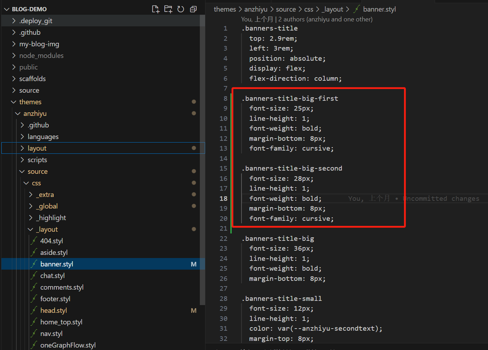

# 前言


本篇文章主要讲述在搭建好HEXO框架项目，搭配安知鱼主题加上一些自定义调整的处理，<font color="#ff0000">不过这里是我自己改造了自己想要的部分，其他的没有做配置我就没去看相关配置，如果有需要的建议去安知鱼官方文档查看</font>，我对于博客的样式调整不是特别多，因为我还是比较喜欢简约点的，不想要太天花乱坠的感觉，就只是一个博客网站看文章的地方简单就挺好。
<font color="#ff0000">注意</font>：
- ***涉及到自定义的图片、文本改动、按钮排版颜色、按钮显示、按钮交互等就在配置文件做改动，就是你感觉初始化的东西有点别扭的情况就针对配置文件去改就可以。***
- ***涉及背景颜色、排版大小高度宽度浮动、特定的图标等就需要针对这个页面的样式去做调整需要定位到具体的前端文件大部分在`.pug`或`.styl`文件里做改动，这部分改动建议在浏览器开`F12`做调整。***
- ***涉及到的顶部的页面：文章、友链、我的、关于其实本质是一个个页面要生效这部分的页面都要在`source`文件夹下创建`index.md`文件才能加载到页面，要不然都是404页面。***


# 安知鱼主题相关链接


- **[GitHub](https://github.com/anzhiyu-c/hexo-theme-anzhiyu)**
- **[安知鱼官方文档](https://docs.anheyu.com/initall.html)**
- **[安知鱼官方页面](https://blog.anheyu.com/)**
- **[安知鱼B站](https://space.bilibili.com/372204786)**

# 首页


如果涉及到换图片的部分，可以去注册一个图床，[聚合图床](https://www.superbed.cn/)或者[去不图床](https://7bu.top/)，我用的是前者，后者好像要收费就没用。当然你也可以把图片放到你的项目里，但是初始化加载会挺慢的。

## 顶部配置

这部分我只做了左侧和中间这部分的改动。


这里的设置主要是定义你自己的链接，可以是你的项目链接或者是你的账号链接

具体修改配置前往你的项目找到`_config.anzhiyu.yml`，搜索配置`nav`，menu可以设置多个title，item下的name是你定义的名称，link是地址链接，icon是你的图标地址。


第一个是一个文章列表，第二个是分类页链接、第三个标签页链接


在`_config.anzhiyu.yml`，搜索配置`menu`，||前面是你本地项目定义的文件夹名，||后面是图标，第一个隧道可以不用做修改，后面的分类和标签，具体生成可以在后面页面设置查看如何生成[页面设置](#page_conf)。


这个我设置成我自己的追番页面了


在上面提到的`menu`配置下面，但是这部分可以不用修改默认就是这个目录名，配置和前面一致，具体生成也在后面的[追番页设置](#amintion_conf)


关于本人是一个新的页面，随便逛逛是随机跳到一个文章去。


这部分还是在上面提到的`menu`配置下面，具体生成配置可前往标题[个人页面](#my_page_conf)，随便逛逛可以根据你自己的需求去做改动

## 顶部图

这里总共分三个部分，左侧的大图可以做一些特效流的改动，安知鱼官方有提供类似[人潮汹涌](https://www.bilibili.com/video/BV1RP411E7rM)的效果可自行去修改，右边的大图是一个简单的图片点击是一个可设置的链接。下面的三个按钮是自己定义的文章分类入口，你的文章是哪个分类就会进入这一类的文章列表。


左侧大图因为我没有选择人潮涌动的效果，只是选择了图标轮播，所以需要单独创建配置文件，定义轮播的信息，而且要把人潮涌动的效果关闭。在`yml`文件下搜索`peoplecanvas`，把`enable:true`改为`enable:false`。


在项目中找到`source`文件夹下面创建`_data/creativity.yml`文件，如果没有source或者_data就手动创建。


追加一下内容，其他技能可以自己追加，图标如果安知鱼没有提供也可以用自己的图床链接
```yaml
- class_name: 开启创造力
  creativity_list:
    - name: Java
      color: "#fff"
      icon: https://bu.dusays.com/2023/04/09/643293b1184e9.jpg    
    - name: Docker
      color: "#57b6e6"
      icon: https://bu.dusays.com/2023/04/09/643293b0f0abe.png
    - name: Photoshop
      color: "#4082c3"
      icon: https://bu.dusays.com/2022/12/15/639aa3a5c240e.png
    - name: Apifox
      color: "#e65164"
      icon: https://bu.dusays.com/2022/11/19/6378d6458c6b6.png
    - name: Node
      color: "#333"
      icon: https://npm.elemecdn.com/anzhiyu-blog@2.1.1/img/svg/node-logo.svg
    - name: Python
      color: "#fff"
      icon: https://bu.dusays.com/2023/04/09/643293b1230f7.png
    - name: JS
      color: "#f7cb4f"
      icon: https://bu.dusays.com/2023/04/09/643293b121f02.png
    - name: Git
      color: "#df5b40"
      icon: https://bu.dusays.com/2023/04/09/643293b10ccdd.webp
```

在图上追加文本信息，在`_config.anzhiyu.yml`配置中搜索`home_top`，把enable设置为true，`title`就是你的文本信息，子文本就是`subTitle`，留底文字`siteText`，其实本质就是三行文本但是文字大小不一致。



如果你的字数比较多或者你想修改字体，这里配置文件就不支持修改了，需要修改`source/css/_layout/banner.styl`和`layout/includes/top/top.pug`两个文件。


这里我建议你自己的css样式单独新增一个样式的方法体，不要在原来的方法体上做修改，因为如果改了原始的css可能别的地方也用了，到时候可能别的地方的样式就有问题了，`banner.styl`这里新增内容，具体模板差不多这样子，你可以自己定义自己的css名字和css样式。
```css
.banners-title-big-first
  font-size: 25px;
  line-height: 1;
  font-weight: bold;
  margin-bottom: 8px;
  font-family: cursive;

.banners-title-big-second
  font-size: 28px;
  line-height: 1;
  font-weight: bold;
  margin-bottom: 8px;
  font-family: cursive;
```


将你自己定义的css样式名字复制到`top.pug`做修改。替换掉前面在配置文件的key名前面的部分，pug文件的定义就是css样式名字=配置文件的key名。


## 文章卡片

## 个人卡片

## 网站统计

## 底部配置


# <h1 id="page_conf">页面设置</h1>

##  Front-matter

## 标签页

## 分类页

## <h2 id="my_page_conf">个人页</h2>


# 看娘设置

# <h1 id="amintion_conf">追番页设置</h1>


