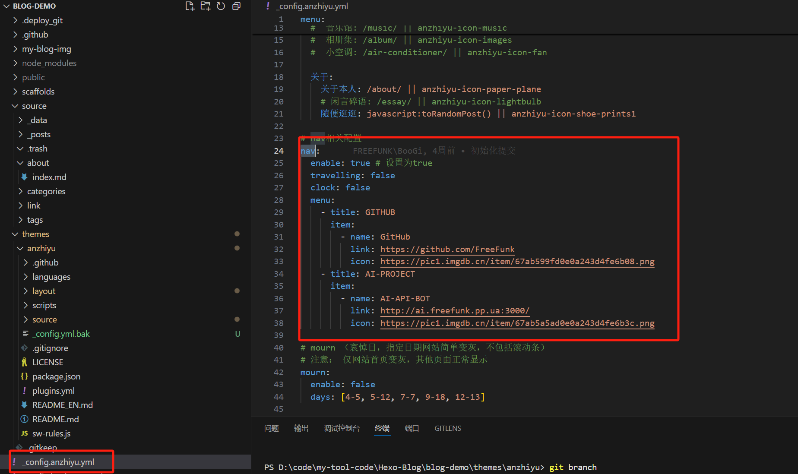
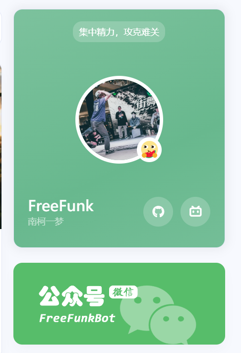
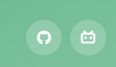
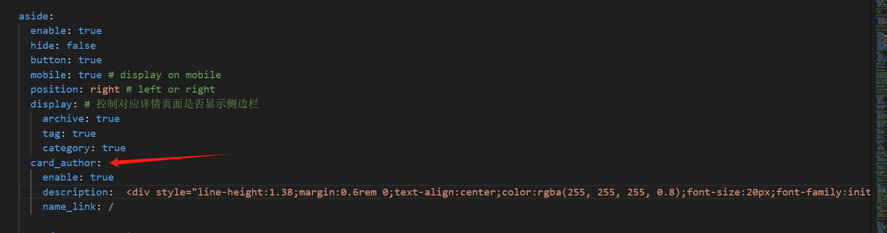

# 前言


本篇文章主要讲述在搭建好HEXO框架项目，搭配安知鱼主题加上一些自定义调整的处理，<font color="#ff0000">不过这里是我自己改造了自己想要的部分，其他的没有做配置我就没去看相关配置，如果有需要的建议去安知鱼官方文档查看</font>，我对于博客的样式调整不是特别多，因为我还是比较喜欢简约点的，不想要太天花乱坠的感觉，就只是一个博客网站看文章的地方简单就挺好。
<font color="#ff0000">注意</font>：
- ***涉及到自定义的图片、文本改动、按钮排版颜色、按钮显示、按钮交互等就在配置文件做改动，就是你感觉初始化的东西有点别扭的情况就针对配置文件去改就可以。***
- ***涉及背景颜色、排版大小高度宽度浮动、特定的图标等就需要针对这个页面的样式去做调整需要定位到具体的前端文件大部分在`.pug`或`.styl`文件里做改动，这部分改动建议在浏览器开`F12`做调整。***
- ***涉及到的顶部的页面：文章、友链、我的、关于其实本质是一个个页面要生效这部分的页面都要在`source`文件夹下创建`index.md`文件才能加载到页面，要不然都是404页面。***


# 安知鱼主题相关链接


- **[GitHub](https://github.com/anzhiyu-c/hexo-theme-anzhiyu)**
- **[安知鱼官方文档](https://docs.anheyu.com/initall.html)**
- **[安知鱼官方页面](https://blog.anheyu.com/)**
- **[安知鱼B站](https://space.bilibili.com/372204786)**

# 首页


如果涉及到换图片的部分，可以去注册一个图床，[聚合图床](https://www.superbed.cn/)或者[去不图床](https://7bu.top/)，我用的是前者，后者好像要收费就没用。当然你也可以把图片放到你的项目里，但是初始化加载会挺慢的。

## 顶部配置

这部分我只做了左侧和中间这部分的改动。


这里的设置主要是定义你自己的链接，可以是你的项目链接或者是你的账号链接

具体修改配置前往你的项目找到`_config.anzhiyu.yml`，搜索配置`nav`，menu可以设置多个title，item下的name是你定义的名称，link是地址链接，icon是你的图标地址。


第一个是一个文章列表，第二个是分类页链接、第三个标签页链接


在`_config.anzhiyu.yml`，搜索配置`menu`，||前面是你本地项目定义的文件夹名，||后面是图标，第一个隧道可以不用做修改，后面的分类和标签，具体生成可以在后面页面设置查看如何生成[页面设置](#page_conf)。


这个我设置成我自己的追番页面了


在上面提到的`menu`配置下面，但是这部分可以不用修改默认就是这个目录名，配置和前面一致，具体生成也在后面的[追番页设置](#amintion_conf)


关于本人是一个新的页面，随便逛逛是随机跳到一个文章去。


这部分还是在上面提到的`menu`配置下面，具体生成配置可前往标题[个人页面](#my_page_conf)，随便逛逛可以根据你自己的需求去做改动

## 顶部图


这里总共分三个部分，左侧的大图可以做一些特效流的改动，安知鱼官方有提供类似[人潮汹涌](https://www.bilibili.com/video/BV1RP411E7rM)的效果可自行去修改，右边的大图是一个简单的图片点击是一个可设置的链接。下面的三个按钮是自己定义的文章分类入口，你的文章是哪个分类就会进入这一类的文章列表。



左侧大图因为我没有选择人潮涌动的效果，只是选择了图标轮播，所以需要单独创建配置文件，定义轮播的信息，而且要把人潮涌动的效果关闭。在`yml`文件下搜索`peoplecanvas`，把`enable:true`改为`enable:false`。


在项目中找到`source`文件夹下面创建`_data/creativity.yml`文件，如果没有source或者_data就手动创建。


追加一下内容，其他技能可以自己追加，图标如果安知鱼没有提供也可以用自己的图床链接
```yaml
- class_name: 开启创造力
  creativity_list:
    - name: Java
      color: "#fff"
      icon: https://bu.dusays.com/2023/04/09/643293b1184e9.jpg    
    - name: Docker
      color: "#57b6e6"
      icon: https://bu.dusays.com/2023/04/09/643293b0f0abe.png
    - name: Photoshop
      color: "#4082c3"
      icon: https://bu.dusays.com/2022/12/15/639aa3a5c240e.png
    - name: Apifox
      color: "#e65164"
      icon: https://bu.dusays.com/2022/11/19/6378d6458c6b6.png
    - name: Node
      color: "#333"
      icon: https://npm.elemecdn.com/anzhiyu-blog@2.1.1/img/svg/node-logo.svg
    - name: Python
      color: "#fff"
      icon: https://bu.dusays.com/2023/04/09/643293b1230f7.png
    - name: JS
      color: "#f7cb4f"
      icon: https://bu.dusays.com/2023/04/09/643293b121f02.png
    - name: Git
      color: "#df5b40"
      icon: https://bu.dusays.com/2023/04/09/643293b10ccdd.webp
```

在图上追加文本信息，在`_config.anzhiyu.yml`配置中搜索`home_top`，把enable设置为true，`title`就是你的文本信息，子文本就是`subTitle`，留底文字`siteText`，其实本质就是三行文本但是文字大小不一致。



如果你的字数比较多或者你想修改字体，这里配置文件就不支持修改了，需要修改`source/css/_layout/banner.styl`和`layout/includes/top/top.pug`两个文件。


这里我建议你自己的css样式单独新增一个样式的方法体，不要在原来的方法体上做修改，因为如果改了原始的css可能别的地方也用了，到时候可能别的地方的样式就有问题了，`banner.styl`这里新增内容，具体模板差不多这样子，你可以自己定义自己的css名字和css样式。
```css
.banners-title-big-first
  font-size: 25px;
  line-height: 1;
  font-weight: bold;
  margin-bottom: 8px;
  font-family: cursive;

.banners-title-big-second
  font-size: 28px;
  line-height: 1;
  font-weight: bold;
  margin-bottom: 8px;
  font-family: cursive;
```


将你自己定义的css样式名字复制到`top.pug`做修改。替换掉前面在配置文件的key名前面的部分，pug文件的定义就是css样式名字=配置文件的key名。



这部分涉及不同类型文章的入口页面


追加完md文件之后配置`_config.anzhiyu.yml`，搜索`home_top`，修改`categories`

三个按钮对应三份页面信息需要单独创建index.md文件，而且建议按照你命名的文字来定义目录，目录层级如下：

追加如下信息，也可以根据你的喜好去修改，具体修改可以跳到[Front-matter](#front-matter)，检查具体配置。
```yml
---
title: 技术 #按钮的名称
date: 2025-02-14 23:18:49 #时间
top_img: false #是否顶部背景使用图片，不一定生效
type: categories #分类类型 默认：categories
comments: false
aside: false
---
```

右侧的大图是一个图片查询点击跳转的功能

文本、图片地址、跳转地址都在配置文件修改`_config.anzhiyu.yml`，搜索`home_top`，修改`banner`配置。`immage`是图片地址，`link`点击图片跳转的地址。


## 文章卡片


文章的设置大部分在配置文件中调整，有一个涉及描述无法显示的bug，我在本地自己调整了需求修改`pug`文件。


`_config.anzhiyu.yml`配置文件中搜索`default_cover`这个配置是文章卡片的默认封面。如果你的文章没有定义封面，默认从配置文件这里取。


在同样配置文件下搜索`post_meta`，调整卡片的基本信息。



需求留一下，就是在初始化没做这块卡片样式修改，会发现你的文章定义的描述`description`，在卡片上不显示。默认配置是给定一个展示的类型和文本长度。`method`是选定一段文本，分两种一个是直接取你的文章描述，一个是从你的文字内容开始，`length`是截取的文本长度。


之后设置完你会发现，你的文章卡片的描述出不来。这样的效果一行空白。


我最后定位到是`themes\anzhiyu\layout\includes\mixins\post-ui.pug`，这个文件做了部分判断逻辑，因为配置文件默认的`method`是2，我也就在2的基础上做改动。

搜索`theme.index_post_content.method`，定位到追加修改的内容，就在`when 2`下做修改，可以沿用我这个内容，因为卡片的文本长度最多32，所以超过32后面的部分拼接...省略号，获取的文本如果你的文章没有定义`description`会默认从文章内容开始截取32个字符展示。<font color="#ff0000">注意空格缩进位。</font>
```js
if article.description
  - const content = strip_html(article.description)
  - let expert = content.substring(0, theme.index_post_content.length)
  - content.length > theme.index_post_content.length ? expert += ' ...' : ''
  .recent-post-info-top!= expert
else
  - const content = strip_html(article.description)
  - let expert = content.substring(0, theme.index_post_content.length)
  - content.length > theme.index_post_content.length ? expert += ' ...' : ''
  .recent-post-info-top!= expert
```
之后重新启动hexo项目就可以看到效果了。


## 个人卡片


这部分内容大都在`_config.anzhiyu.yml`配置里修改，只有左下角的内容是需要在`_config.yml`做配置，分为两个部分下面的微信公众号得自己去申请。主色调的调整可以在`theme_color`配置里修改



头像修改在`avatar`配置下，修改图片地址，`effect`设置为`true`的话你的头像会转起来。

头像的右下角的小图标也是一个图片地址，在`author_status`做修改，你要先设置启用状态`enable:true`，修改`statusImg`就可以显示你的右下角图标。

左下角的文本和名字是在另一个文件配置中设置，也是你的网站浏览器窗口tab的文本信息。

具体在`_config.yml`文件，注意不是前面的`_config.anzhiyu.yml`是另一个文件这个文件是HEXO自己的配置文件。

搜索`title`，找到几行配置进行修改即可。title是前面的部分可以定义任何信息，subtitle是后面的部分也是个人卡片的描述，`author`是你自己定义的名字。

配置信息
```yml
title: FreeFunk
subtitle: 南柯一梦
description: ''
keywords:
author: FreeFunk
language: zh-CN
timezone: ''
```
右边的两个跳转链接就回到我们一开始的配置文件`_config.anzhiyu.yml`下操作。

搜索`social`，修改地址和图标即可

最后这个卡片有一个交互就是鼠标悬浮到卡片上会翻转卡片，这里可以定义你的文本，不过这部分是一个html的文本信息。

搜索`card_author`，启用配置修改`description`配置即可。

配置信息如下，注意`aside.enable`也要设置true，卡片才能开启。
~~~yml
aside:
  enable: true
  hide: false
  button: true
  mobile: true # display on mobile
  position: right # left or right
  display: # 控制对应详情页面是否显示侧边栏
    archive: true
    tag: true
    category: true
  card_author:
    enable: true
    description:  <div style="line-height:1.38;margin:0.6rem 0;text-align:center;color:rgba(255, 255, 255, 0.8);font-size:20px;font-family:initial;font-weight:bold;">要么一切，要么全无</div> # 默认为站点描述
    name_link: /
~~~
下方的公众号你可以自己申请，自己PS设计一下排版，生成两张图片一个是正面的一个是背面的。


配置修改在`card_weixin`配置中，打开启用，face就是正面图，backFace就是背面图。

## 网站统计


位于右下角的内容显示



可以去安知鱼文档检查有很多配置包括什么最近更新时间、总字数什么的，这里我只放了这三份。在配置文件`_config.anzhiyu.yml`，搜索`runtimeshow`配置启用，定义`publish_date`配置这是定义你自己博客网站的建站开始时间，格式是:`m/DD/yyyy HH:mm:ss`。

```yml
# Time difference between publish date and now (网页运行时间)
# Formal: Month/Day/Year Time or Year/Month/Day Time
runtimeshow:
  enable: true
  publish_date: 2/10/2025 00:00:00
```
文章总数要搜索配置`card_webinfo`，设置启用配置`post_count:true`，统计文章总数。`last_push_date`配置是最近更新时间。

```yml
card_webinfo:
  enable: true
  post_count: true
  last_push_date: false
  sort_order: # Don't modify the setting unless you know how it works
```
字数统计配置搜索`wordcount`，这部分的改动也会同步修改到文章内部的统计，主题会把这个字数统计的配置用在全局中。

`post_wordcount`是文章内部的总字数，`total_wordcount`是全站总字数。
```yml
# wordcount (字数统计)
# see https://blog.anheyu.com/posts/c27d.html#字数统计
wordcount:
  enable: true
  post_wordcount: true
  min2read: true
  total_wordcount: true
```
## 底部配置


底部配置我设置的内容比较少，底部设置的内容很多，有需求的小伙伴可以查看文档追加，基本就是设置启用就可以看到了，然后在配置自己各个的平台地址，设置自己喜欢的图标就可以了。



这部分的内容配置在`_config.anzhiyu.yml`，搜索`footer`涉及的配置很多，有`owner、runtime、bdageitem、socialBar、list、footerBar`需要什么就开启启用。

我这部分涉及`socialBar`就一行简单的平台链接，`title`是显示文本，`link`是地址链接、`icon`是显示图标，区分左右。

```yml
socialBar:
  enable: true
  centerImg:
  left:
    - title: email
      link: mailto:2917426372@qq.com
      icon: anzhiyu-icon-envelope
    - title: 微博
      link: https://weibo.com/u/6229901786
      icon: anzhiyu-icon-weibo
    - title: facebook
      link: https://www.facebook.com/profile.php?id=100092208016287&sk=about
      icon: anzhiyu-icon-facebook1
    # - title: RSS
    #   link: atom.xml
    #   icon: anzhiyu-icon-rss
  right:
    - title: Github
      link: https://github.com/FreeFunk
      icon: anzhiyu-icon-github
    - title: Bilibili
      link: https://space.bilibili.com/242466102
      icon: anzhiyu-icon-bilibili
    - title: 抖音
      link: https://v.douyin.com/iPvHXkYo/
      icon: anzhiyu-icon-tiktok
```
# <h1 id="page_conf">页面设置</h1>



##  <h2 id="front-matter">Front-matter</h2>

## 标签页

## 分类页

## <h2 id="my_page_conf">个人页</h2>


# 看娘设置

# <h1 id="amintion_conf">追番页设置</h1>


# 全站搜索器
