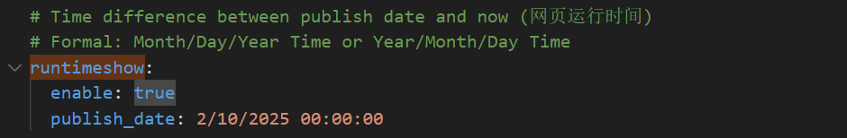
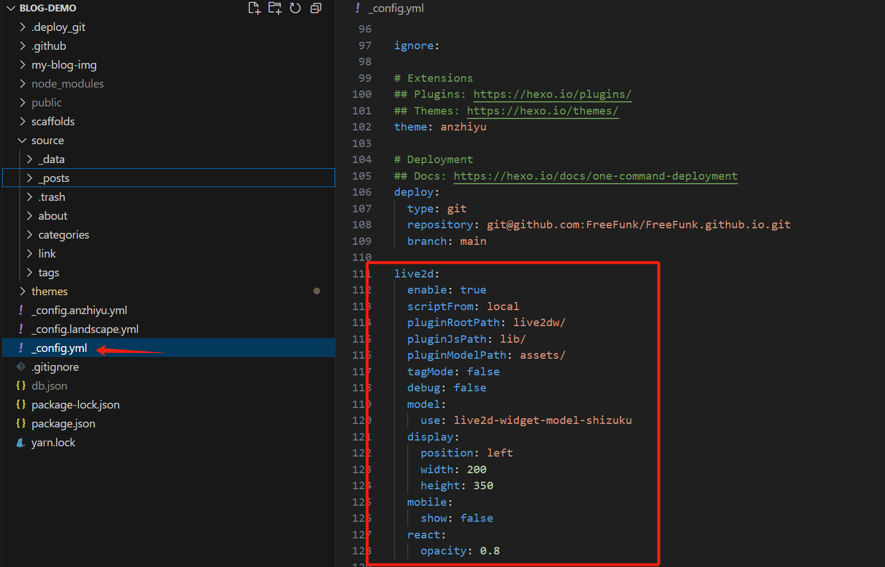

# 前言


本篇文章主要讲述在搭建好HEXO框架项目，搭配安知鱼主题加上一些自定义调整的处理，<font color="#ff0000">不过这里是我自己改造了自己想要的部分，其他的没有做配置我就没去看相关配置，如果有需要的建议去安知鱼官方文档查看</font>，我对于博客的样式调整不是特别多，因为我还是比较喜欢简约点的，不想要太天花乱坠的感觉，就只是一个博客网站看文章的地方简单就挺好。
<font color="#ff0000">注意</font>：
- ***涉及到自定义的图片、文本改动、按钮排版颜色、按钮显示、按钮交互等就在配置文件做改动，就是你感觉初始化的东西有点别扭的情况就针对配置文件去改就可以。***
- ***涉及背景颜色、排版大小高度宽度浮动、特定的图标等就需要针对这个页面的样式去做调整需要定位到具体的前端文件大部分在`.pug`或`.styl`文件里做改动，这部分改动建议在浏览器开`F12`做调整。***
- ***涉及到的顶部的页面：文章、友链、我的、关于其实本质是一个个页面要生效这部分的页面都要在`source`文件夹下创建`index.md`文件才能加载到页面，要不然都是404页面。***


# 安知鱼主题相关链接


- **[GitHub](https://github.com/anzhiyu-c/hexo-theme-anzhiyu)**
- **[安知鱼官方文档](https://docs.anheyu.com/initall.html)**
- **[安知鱼官方页面](https://blog.anheyu.com/)**
- **[安知鱼B站](https://space.bilibili.com/372204786)**


# 首页


如果涉及到换图片的部分，可以去注册一个图床，[聚合图床](https://www.superbed.cn/)或者[去不图床](https://7bu.top/)，我用的是前者，后者好像要收费就没用。当然你也可以把图片放到你的项目里，但是初始化加载会挺慢的。


## 顶部配置

这部分我只做了左侧和中间这部分的改动。


这里的设置主要是定义你自己的链接，可以是你的项目链接或者是你的账号链接

具体修改配置前往你的项目找到`_config.anzhiyu.yml`，搜索配置`nav`，menu可以设置多个title，item下的name是你定义的名称，link是地址链接，icon是你的图标地址。


第一个是一个文章列表，第二个是分类页链接、第三个标签页链接


在`_config.anzhiyu.yml`，搜索配置`menu`，||前面是你本地项目定义的文件夹名，||后面是图标，第一个隧道可以不用做修改，后面的分类和标签，具体生成可以在后面页面设置查看如何生成[页面设置](#page_conf)。


这个我设置成我自己的追番页面了


在上面提到的`menu`配置下面，但是这部分可以不用修改默认就是这个目录名，配置和前面一致，具体生成也在后面的[追番页设置](#amintion_conf)


关于本人是一个新的页面，随便逛逛是随机跳到一个文章去。


这部分还是在上面提到的`menu`配置下面，具体生成配置可前往标题[个人页面](#my_page_conf)，随便逛逛可以根据你自己的需求去做改动


## 顶部图


这里总共分三个部分，左侧的大图可以做一些特效流的改动，安知鱼官方有提供类似[人潮汹涌](https://www.bilibili.com/video/BV1RP411E7rM)的效果可自行去修改，右边的大图是一个简单的图片点击是一个可设置的链接。下面的三个按钮是自己定义的文章分类入口，你的文章是哪个分类就会进入这一类的文章列表。



左侧大图因为我没有选择人潮涌动的效果，只是选择了图标轮播，所以需要单独创建配置文件，定义轮播的信息，而且要把人潮涌动的效果关闭。在`yml`文件下搜索`peoplecanvas`，把`enable:true`改为`enable:false`。


在项目中找到`source`文件夹下面创建`_data/creativity.yml`文件，如果没有source或者_data就手动创建。


追加一下内容，其他技能可以自己追加，图标如果安知鱼没有提供也可以用自己的图床链接
```yaml
- class_name: 开启创造力
  creativity_list:
    - name: Java
      color: "#fff"
      icon: https://bu.dusays.com/2023/04/09/643293b1184e9.jpg    
    - name: Docker
      color: "#57b6e6"
      icon: https://bu.dusays.com/2023/04/09/643293b0f0abe.png
    - name: Photoshop
      color: "#4082c3"
      icon: https://bu.dusays.com/2022/12/15/639aa3a5c240e.png
    - name: Apifox
      color: "#e65164"
      icon: https://bu.dusays.com/2022/11/19/6378d6458c6b6.png
    - name: Node
      color: "#333"
      icon: https://npm.elemecdn.com/anzhiyu-blog@2.1.1/img/svg/node-logo.svg
    - name: Python
      color: "#fff"
      icon: https://bu.dusays.com/2023/04/09/643293b1230f7.png
    - name: JS
      color: "#f7cb4f"
      icon: https://bu.dusays.com/2023/04/09/643293b121f02.png
    - name: Git
      color: "#df5b40"
      icon: https://bu.dusays.com/2023/04/09/643293b10ccdd.webp
```

在图上追加文本信息，在`_config.anzhiyu.yml`配置中搜索`home_top`，把enable设置为true，`title`就是你的文本信息，子文本就是`subTitle`，留底文字`siteText`，其实本质就是三行文本但是文字大小不一致。



如果你的字数比较多或者你想修改字体，这里配置文件就不支持修改了，需要修改`source/css/_layout/banner.styl`和`layout/includes/top/top.pug`两个文件。


这里我建议你自己的css样式单独新增一个样式的方法体，不要在原来的方法体上做修改，因为如果改了原始的css可能别的地方也用了，到时候可能别的地方的样式就有问题了，`banner.styl`这里新增内容，具体模板差不多这样子，你可以自己定义自己的css名字和css样式。
```css
.banners-title-big-first
  font-size: 25px;
  line-height: 1;
  font-weight: bold;
  margin-bottom: 8px;
  font-family: cursive;

.banners-title-big-second
  font-size: 28px;
  line-height: 1;
  font-weight: bold;
  margin-bottom: 8px;
  font-family: cursive;
```


将你自己定义的css样式名字复制到`top.pug`做修改。替换掉前面在配置文件的key名前面的部分，pug文件的定义就是css样式名字=配置文件的key名。



这部分涉及不同类型文章的入口页面


追加完md文件之后配置`_config.anzhiyu.yml`，搜索`home_top`，修改`categories`


三个按钮对应三份页面信息需要单独创建index.md文件，而且建议按照你命名的文字来定义目录，目录层级如下：


追加如下信息，也可以根据你的喜好去修改，具体修改可以跳到[Front-matter](#front-matter)，检查具体配置。
```yml
---
title: 技术 #按钮的名称
date: 2025-02-14 23:18:49 #时间
top_img: false #是否顶部背景使用图片，不一定生效
type: categories #分类类型 默认：categories
comments: false
aside: false
---
```

右侧的大图是一个图片查询点击跳转的功能


文本、图片地址、跳转地址都在配置文件修改`_config.anzhiyu.yml`，搜索`home_top`，修改`banner`配置。`immage`是图片地址，`link`点击图片跳转的地址。


## 文章卡片


文章的设置大部分在配置文件中调整，有一个涉及描述无法显示的bug，我在本地自己调整了需求修改`pug`文件。



`_config.anzhiyu.yml`配置文件中搜索`default_cover`这个配置是文章卡片的默认封面。如果你的文章没有定义封面，默认从配置文件这里取。


在同样配置文件下搜索`post_meta`，调整卡片的基本信息。



需求留一下，就是在初始化没做这块卡片样式修改，会发现你的文章定义的描述`description`，在卡片上不显示。默认配置是给定一个展示的类型和文本长度。`method`是选定一段文本，分两种一个是直接取你的文章描述，一个是从你的文字内容开始，`length`是截取的文本长度。


之后设置完你会发现，你的文章卡片的描述出不来。这样的效果一行空白。


我最后定位到是`themes\anzhiyu\layout\includes\mixins\post-ui.pug`，这个文件做了部分判断逻辑，因为配置文件默认的`method`是2，我也就在2的基础上做改动。


搜索`theme.index_post_content.method`，定位到追加修改的内容，就在`when 2`下做修改，可以沿用我这个内容，因为卡片的文本长度最多32，所以超过32后面的部分拼接...省略号，获取的文本如果你的文章没有定义`description`会默认从文章内容开始截取32个字符展示。<font color="#ff0000">注意空格缩进位。</font>
```js
if article.description
  - const content = strip_html(article.description)
  - let expert = content.substring(0, theme.index_post_content.length)
  - content.length > theme.index_post_content.length ? expert += ' ...' : ''
  .recent-post-info-top!= expert
else
  - const content = strip_html(article.description)
  - let expert = content.substring(0, theme.index_post_content.length)
  - content.length > theme.index_post_content.length ? expert += ' ...' : ''
  .recent-post-info-top!= expert
```

之后重新启动hexo项目就可以看到效果了。



## 个人卡片


这部分内容大都在`_config.anzhiyu.yml`配置里修改，只有左下角的内容是需要在`_config.yml`做配置，分为两个部分下面的微信公众号得自己去申请。主色调的调整可以在`theme_color`配置里修改



头像修改在`avatar`配置下，修改图片地址，`effect`设置为`true`的话你的头像会转起来。


头像的右下角的小图标也是一个图片地址，在`author_status`做修改，你要先设置启用状态`enable:true`，修改`statusImg`就可以显示你的右下角图标。


左下角的文本和名字是在另一个文件配置中设置，也是你的网站浏览器窗口tab的文本信息。


具体在`_config.yml`文件，注意不是前面的`_config.anzhiyu.yml`是另一个文件这个文件是HEXO自己的配置文件。


搜索`title`，找到几行配置进行修改即可。title是前面的部分可以定义任何信息，subtitle是后面的部分也是个人卡片的描述，`author`是你自己定义的名字。


配置信息
```yml
title: FreeFunk
subtitle: 南柯一梦
description: ''
keywords:
author: FreeFunk
language: zh-CN
timezone: ''
```

右边的两个跳转链接就回到我们一开始的配置文件`_config.anzhiyu.yml`下操作。


搜索`social`，修改地址和图标即可


最后这个卡片有一个交互就是鼠标悬浮到卡片上会翻转卡片，这里可以定义你的文本，不过这部分是一个html的文本信息。


搜索`card_author`，启用配置修改`description`配置即可。


配置信息如下，注意`aside.enable`也要设置true，卡片才能开启。
~~~yml
aside:
  enable: true
  hide: false
  button: true
  mobile: true # display on mobile
  position: right # left or right
  display: # 控制对应详情页面是否显示侧边栏
    archive: true
    tag: true
    category: true
  card_author:
    enable: true
    description:  <div style="line-height:1.38;margin:0.6rem 0;text-align:center;color:rgba(255, 255, 255, 0.8);font-size:20px;font-family:initial;font-weight:bold;">要么一切，要么全无</div> # 默认为站点描述
    name_link: /
~~~

下方的公众号你可以自己申请，自己PS设计一下排版，生成两张图片一个是正面的一个是背面的。


配置修改在`card_weixin`配置中，打开启用，face就是正面图，backFace就是背面图。


## 网站统计


位于右下角的内容显示



可以去安知鱼文档检查有很多配置包括什么最近更新时间、总字数什么的，这里我只放了这三份。在配置文件`_config.anzhiyu.yml`，搜索`runtimeshow`配置启用，定义`publish_date`配置这是定义你自己博客网站的建站开始时间，格式是:`m/DD/yyyy HH:mm:ss`。

```yml
# Time difference between publish date and now (网页运行时间)
# Formal: Month/Day/Year Time or Year/Month/Day Time
runtimeshow:
  enable: true
  publish_date: 2/10/2025 00:00:00
```

文章总数要搜索配置`card_webinfo`，设置启用配置`post_count:true`，统计文章总数。`last_push_date`配置是最近更新时间。


```yml
card_webinfo:
  enable: true
  post_count: true
  last_push_date: false
  sort_order: # Don't modify the setting unless you know how it works
```

字数统计配置搜索`wordcount`，这部分的改动也会同步修改到文章内部的统计，主题会把这个字数统计的配置用在全局中。


`post_wordcount`是文章内部的总字数，`total_wordcount`是全站总字数。
```yml
# wordcount (字数统计)
# see https://blog.anheyu.com/posts/c27d.html#字数统计
wordcount:
  enable: true
  post_wordcount: true
  min2read: true
  total_wordcount: true
```
## 底部配置


底部配置我设置的内容比较少，底部设置的内容很多，有需求的小伙伴可以查看文档追加，基本就是设置启用就可以看到了，然后在配置自己各个的平台地址，设置自己喜欢的图标就可以了。



这部分的内容配置在`_config.anzhiyu.yml`，搜索`footer`涉及的配置很多，有`owner、runtime、bdageitem、socialBar、list、footerBar`需要什么就开启启用。


我这部分涉及`socialBar`就一行简单的平台链接，`title`是显示文本，`link`是地址链接、`icon`是显示图标，区分左右。


```yml
socialBar:
  enable: true
  centerImg:
  left:
    - title: email
      link: mailto:2917426372@qq.com
      icon: anzhiyu-icon-envelope
    - title: 微博
      link: https://weibo.com/u/6229901786
      icon: anzhiyu-icon-weibo
    - title: facebook
      link: https://www.facebook.com/profile.php?id=100092208016287&sk=about
      icon: anzhiyu-icon-facebook1
    # - title: RSS
    #   link: atom.xml
    #   icon: anzhiyu-icon-rss
  right:
    - title: Github
      link: https://github.com/FreeFunk
      icon: anzhiyu-icon-github
    - title: Bilibili
      link: https://space.bilibili.com/242466102
      icon: anzhiyu-icon-bilibili
    - title: 抖音
      link: https://v.douyin.com/iPvHXkYo/
      icon: anzhiyu-icon-tiktok
```

<h1 id="page_conf">页面设置</h1>


这部分的内容其实就是在定义一些页面的基础信息，通过`md`文件的头部配置信息，定义一些全局变量，通过这些变量就可以生成一个页面的基础信息。这里的页面设置又分为`page`页面设置和`post`文章设置。


<h2 id="front-matter">Front-matter</h2>


用于头部定义的配置信息的语法，[Front-matter简介和视频](https://hexo.io/zh-cn/docs/front-matter)有说明这部分的信息，需要什么就定义什么。
[安知鱼文档Front-matter链接](https://docs.anheyu.com/page/front-matter.html)


### Page Front-matter

| 写法                    | 解释                                                             |
| --------------------- | -------------------------------------------------------------- |
| title                 | 【必需】页面标题                                                       |
| date                  | 【必需】页面创建日期                                                     |
| type                  | 【必需】标签、分类、关于、音乐馆、友情链接、相册、相册详情、朋友圈、即刻页面需要配置                     |
| updated               | 【可选】页面更新日期                                                     |
| description           | 【可选】页面描述                                                       |
| keywords              | 【可选】页面关键字                                                      |
| comments              | 【可选】显示页面评论模块(默认 true)                                          |
| top_img               | 【可选】页面顶部图片                                                     |
| mathjax               | 【可选】显示 mathjax(当设置 mathjax 的 per_page: false 时，才需要配置，默认 false) |
| katex                 | 【可选】显示 katex(当设置 katex 的 per_page: false 时，才需要配置，默认 false)     |
| aside                 | 【可选】显示侧边栏 (默认 true)                                            |
| aplayer               | 【可选】在需要的页面加载 aplayer 的 js 和 css,请参考文章下面的音乐 配置                  |
| highlight_shrink      | 【可选】配置代码框是否展开(true/false)(默认为设置中 highlight_shrink 的配置)         |
| top_single_background | 【可选】部分页面的顶部模块背景图片                                              |

### Post Front-matter

| 写法                    | 解释                                                             |
| --------------------- | -------------------------------------------------------------- |
| title                 | 【必需】文章标题                                                       |
| date                  | 【必需】文章创建日期                                                     |
| updated               | 【可选】文章更新日期                                                     |
| tags                  | 【可选】文章标签                                                       |
| categories            | 【可选】文章分类                                                       |
| keywords              | 【可选】文章关键字                                                      |
| description           | 【可选】文章描述                                                       |
| top_img               | 【可选】文章顶部图片                                                     |
| cover                 | 【可选】文章缩略图(如果没有设置 top_img,文章页顶部将显示缩略图，可设为 false/图片地址/留空)        |
| comments              | 【可选】显示文章评论模块(默认 true)                                          |
| toc                   | 【可选】显示文章 TOC(默认为设置中 toc 的 enable 配置)                           |
| toc_number            | 【可选】显示 toc_number(默认为设置中 toc 的 number 配置)                      |
| toc_style_simple      | 【可选】显示 toc 简洁模式                                                |
| copyright             | 【可选】显示文章版权模块(默认为设置中 post_copyright 的 enable 配置)                |
| copyright_author      | 【可选】文章版权模块的`文章作者`                                              |
| copyright_author_href | 【可选】文章版权模块的`文章作者`链接                                            |
| copyright_url         | 【可选】文章版权模块的`文章链接`链接                                            |
| copyright_info        | 【可选】文章版权模块的版权声明文字                                              |
| mathjax               | 【可选】显示 mathjax(当设置 mathjax 的 per_page: false 时，才需要配置，默认 false) |
| katex                 | 【可选】显示 katex(当设置 katex 的 per_page: false 时，才需要配置，默认 false)     |
| aplayer               | 【可选】在需要的页面加载 aplayer 的 js 和 css,请参考文章下面的`音乐` 配置                |
| highlight_shrink      | 【可选】配置代码框是否展开(true/false)(默认为设置中 highlight_shrink 的配置)         |
| aside                 | 【可选】显示侧边栏 (默认 true)                                            |
| swiper_index          | 【可选】首页轮播图配置 index 索引，数字越小越靠前                                   |
| top_group_index       | 【可选】首页右侧卡片组配置, 数字越小越靠前                                         |
| ai                    | 【可选】文章ai摘要                                                     |
| main_color            | 【可选】文章主色，必须是16进制颜色且有6位，不可缩减，例如#ffffff 不可写成#fff                 |


我本人写文章一般喜欢用的配置如下，喜欢的可以使用。
```yml
---
title:  #文章标题
date: #文章创建日期
updated:  #文章更新日期
categories: #文章分类
tags: #文章标签
keywords: #文章关键字
description: #文章描述
top_img: #文章顶部图片
cover: #文章缩略图(如果没有设置 top_img,文章页顶部将显示缩略图，可设为 false/图片地址/留空)
copyright_author: 'FreeFunk' #文章版权模块的文章作者 
copyright_author_href: 'https://blog.freefunk.pp.ua' #文章版权模块的文章作者链接
main_color: '#e1efe1' #文章主色，必须是16进制颜色且有6位，不可缩减，例如#ffffff 不可写成#fff
highlight_shrink: false #配置代码框是否展开(true/false)(默认为设置中 highlight_shrink 的配置)
abbrlink: #随机字符串用作文章博客唯一键
mathjax: true #文章分类
thumbnail: false
---
```


## 标签页


根据上面的`Front-matter`对`md`文件定义你就可以设置你的标签页的配置了，[安知鱼定义标签页](https://docs.anheyu.com/page/tags.html)可以通过`hexo`生成一个文件目录，当然你可以自己直接创建出来。


这是我本地自己定义的标签`md`文件，主要是要定义`type: "tags"`
```yml
---
title: 标签
date: 2025-02-13 16:47:18
type: "tags"
comments: false
aside: false
top_img: false
updated:
description:
keywords:
mathjax:
katex:
aplayer:
highlight_shrink:
top_single_background:
---
```

不做任何修饰的效果就是会收集你自己所有文章的`tags`标签信息展示。如果你想做一些调整可以在标签的`md`自行追加，就像写页面html的语法一样。


## 分类页


和上面的标签页一样的步骤，[安知鱼定义分类页](https://docs.anheyu.com/page/classify.html)。


定义一样的`md`文件，留意这个类型`type: categories`
```yml
---
title: 分类
date: 2025-03-01 12:09:49
top_img: false
type: categories
comments: false
aside: false
updated: 
description: 
keywords: 
mathjax: 
katex: 
aplayer: 
highlight_shrink: 
top_single_background:
---
```

没做任何修饰的页面也是和标签页一样，要做修改也是和标签页一样的逻辑。


<h2 id="my_page_conf">个人页</h2>


配置个人页面需要涉及两步，一个是定义`md`文件一个是配置一个`about.yml`配置项，[安知鱼关于页面配置](https://docs.anheyu.com/page/about.html)。



同样可以通过`hexo`命令生成一个about目录出现一个`md`文件，也可以自己直接生成`source\about\index.md`目录。定义的`front-matter`配置。
```yml
---
title:
date: 2025-02-15 14:36:59
type: "about"
updated:
comments: false
description:
keywords:
mathjax:
katex:
aside: false
aplayer:
highlight_shrink:
top_single_background: "#68b88e"
background: "#68b88e"
---
```

之后在`_config.anzhiyu.yml`配置文件追加你的个人页面路径。搜索`menu`查找。


之后在目录`source/_data/about.yml`找到这个`yml`文件，没有就新建一个。



注意：这里涉及的一些必须的配置是需要配置，要不然会报错，如果有些配置你不想需要，你需要去对应的`about.pug`文件进行注释删除，目录路径`themes\anzhiyu\layout\includes\page\about.pug`。


方法就是找到对应的配置去到这个`about.pug`进行搜索，找到对应的一个方法体进行注释。


这样就可以比较灵活的配成你想要的样子，包括可以移动这些内容的位置，包括内容方块的样式、字体大小，图片大小都可以设置，这个文件位于`themes\anzhiyu\source\css\_page\about.styl`。



# 看娘设置


看娘就是在你的页面上加一个2d动漫人物，一般都是别人定义好的模型，直接拽过来用就可以，如果你想要自己想要的动漫人物模型需要去查看涉及`live2d`技术栈内容。
[hexo适配的live2d](https://github.com/EYHN/hexo-helper-live2d)这个是一个GitHub项目，不过项目比较久远了，如果想用更新的模型可以用这个项目[支持操作项的live2D](https://github.com/stevenjoezhang/live2d-widget)项目比较新现在作者还在更新，支持点击交互发送消息等等，如果不喜欢的话可以去按照`live2D 看娘 Git项目`字条去搜索内容。


这是我自己的效果，包括模型大小，位置都可以在配置文件定义。模型名称是`live2d-widget-model-shizuku`


安装模型，[模型列表](https://blog.csdn.net/wang_123_zy/article/details/87181892#live2dwidgetmodelchitose_12)
```shell
npm install --save '模型的名称'
```

安装完之后在你的`_config.yml`追加配置信息，[配置参数说明](https://l2dwidget.js.org/docs/class/src/index.js~L2Dwidget.html#instance-method-init)


我本人的配置信息就比较少，主要调整一个位置和大小，并且在移动端不显示，因为这个`live2D`不会根据你的窗口自适应缩放，这样在移动端看娘会占大部分的窗口看不到东西。配置完之后重启就可以查看。
```yml
live2d:
  enable: true
  scriptFrom: local
  pluginRootPath: live2dw/
  pluginJsPath: lib/
  pluginModelPath: assets/
  tagMode: false
  debug: false
  model:
    use: live2d-widget-model-shizuku
  display:
    position: left
    width: 200
    height: 350
  mobile:
    show: false
  react:
    opacity: 0.8
```

<h1 id="amintion_conf">追番页设置</h1>


追番这个不必多说，我想每个二次元都想展示自己的阅番战绩，我用的`Git`项目是[hexo插件结合B站和Bangumi](https://github.com/HCLonely/hexo-bilibili-bangumi)，项目有一个好处是不限制拉取的网站内容，有些番在B站没有，但是在Bangumi是有的，所以我这里选择的是Bangumi的数据源。不过这个前提是你必要要有一个番站记录地址，手动在网站配你自己看过的动漫番这样这个插件才会拉到你的内容。
拉取流程是本地安装插件，配置你的番站账号唯一键在配置文件里，设置你要拉取的数据源网站，之后执行拉取命令，这样会在你的`HEXO`项目中的`_source\_data`出现一些页面内容和`json`文件都是你自己设置已经看过的番，之后部署就可以看到你的追番信息。



登录[Bangumi](https://bgm.tv/anime)点击右上角的注册，注册一个账号。


搜索你看过，或者你正在看或者你想看的番名。这个支持降噪查询非常nice。


点击收藏，出现几个按钮想看、看过、在看，根据自己的需求选择。


这个记录评价就根据自己来看，总之就是要记录一个数据方便后面获取。


收录完你自己的动漫番数据，就回到你的项目安装插件。
```shell
npm install hexo-bilibili-bangumi --save
```

安装完之后去到你的`_config.yml`文件配置信息


以下是我本人的内容主要是定义数据源、定义名称，初始化展示的tab列表，还有我的bangumi账号id。
- 记得`enable`启用状态要打开。
- 修改`source`为`bgm`。
- 配置`order`排序支持`latest`(默认，按添加时间排序), `score`(评分升序), `-score`(评分降序)。
- `show`配置是初始化打开的窗口，`0: 想看`, `1: 在看`, `2: 看过`，默认为`1`
- `title`和`quote`在上面的文字展示
- 至于`cinema`和`game`这两个是动漫电影和动漫游戏有需求的可以根据GitHub项目的描述设置。
<font color="#ff0000">注意：`lazyload`这个配置一定要设置为`false`，因为涉及懒加载的问题。</font>

```yml
# 追番插件
# https://github.com/HCLonely/hexo-bilibili-bangumi
bangumi: # 追番设置
  enable: true
  source: bgm
  # bgmInfoSource: 'bgmv0'
  path:
  vmid: 971164
  title: '追番列表'
  quote: '呜呜呜，二次元很美好...呜呜呜'
  show: 2
  lazyload: false
  srcValue: '__image__'
  lazyloadAttrName: 'data-src=__image__'
  loading:
  showMyComment: false
  pagination: false
  metaColor:
  color:
  webp:
  progress:
  progressBar:
  extraOrder:
  order: latest
  # proxy:
  #   host: '代理host'
  #   port: '代理端口'
  extra_options:
    key: value
  coverMirror:
cinema: # 追剧设置
  enable: false
  path:
  vmid: 242466102
  title: '追剧列表'
  quote: '生命不息，追剧不止！'
  show: 2
  lazyload: false
  srcValue: '__image__'
  lazyloadAttrName: 'data-src=__image__'
  loading:
  metaColor:
  color:
  webp:
  progress:
  progressBar:
  extraOrder:
  order:
  extra_options:
    key: value
  coverMirror:
game: # 游戏设置，仅支持source: bgmv0
  enable: false
  path:
  source: bgmv0
  vmid:
  title: '游戏列表'
  quote: '生命不息，游戏不止！'
  show: 1
  lazyload: false
  srcValue: '__image__'
  lazyloadAttrName: 'data-src=__image__'
  loading:
  metaColor:
  color:
  webp:
  progress:
  progressBar:
  extraOrder:
  order:
  extra_options:
    key: value
  coverMirror:
```

获取你自己的bangumi的账号id，在bangumi页面开启`F12`输入一个`js`命令


我用第一个命令没生效，最后选择的最后一个获取id的方式，获取的id复制到配置文件中的`vmid`配置
```js
//用户名
document.getElementById('header').getElementsByTagName('a')[0].getAttribute('href').split('/').at(-1)
//id
CHOBITS_UID
```


配置完信息，执行拉取命令
```shell
# 更新追番数据
hexo bangumi -u
# 更新追剧数据
hexo cinema -u
# 删除清空追番数据
hexo bangumi -d
# 删除清空追剧数据
hexo cinema -d
```


最后生成完数据可以去到自己的项目目录`source\_data`


最后在`_config.anzhiyu.yml`配置文件中把你的追番页打开，重启项目即可看到你的战绩。

# 全站搜索器


搜索器是针对文章标题、内容等等做全局搜索，安装一个插件[hexo-generator-search](https://github.com/wzpan/hexo-generator-search)即可，做一个配置项就可以使用。



安装插件
```shell
npm install hexo-generator-search --save
```

安装成功之后前往`_config.anzhiyu.yml`配置文件，搜索`local_search`，设置`enable: true`，重启即可使用。


# 总结


这部分的内容近期就到这里，后续有新的插件或者改动的地方会继续更新，安知鱼提供的主题还有很多很好玩的部分，包括音乐浮窗，文章尾部设置，打赏，充电等等修饰的小组件，不过需要对文档多查看一下，改动很简单，遇到问题也不要着急，这个主题结合`HEXO`框架还是非常简约的，因为本人比较喜欢简单点，就没有那么复杂，大家可以去安知鱼官网下的友链有很多小伙伴的博客做得非常帅气，大家也可以参数别人的设计和排版，如果自己没有博客页面设计灵感可以先看看别人的博客网站。
