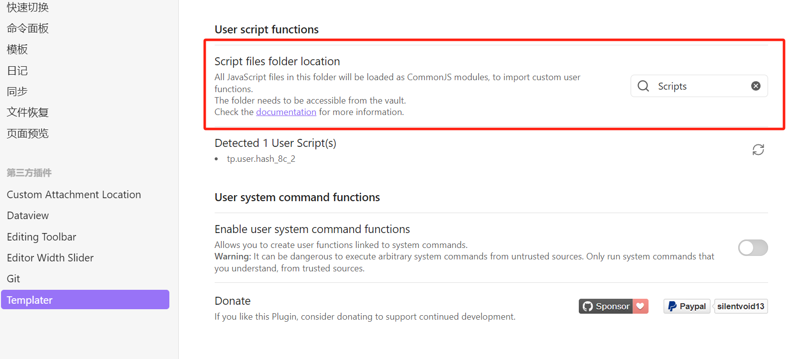

# 前言


本文章主要是解决在准备博客网站的文章，如何更好的写文章包括文章的保存提交，同步到你的博客网站中。
这里主要写文章的平台是[Obsidian](https://obsidian.md/)，主要是这个支持装插件界面也很简约，并且每个文章仓库管理都是独立的，文章文件夹之间互不影响。
其他的写文章的平台包括[typora](https://typora.io/)上大学的时候一直都是用这个写`markdown`文章也是非常方便，但是没有用过`Git`去做同步提交的动作就放弃了这个，还有国内的[我来](https://www.wolai.com/)这个我没用过但是看界面也还可以。


# 安装Obsidian

前往[Obsidian](https://obsidian.md/)平台，点击`Get Obsidian for Windows`


之后点击`Download`下载安装包，在本地安装即可


# 创建一个本地仓库

打开`Obsidian`之后，看到窗口打开一个本地的文件，这个文件夹是你自己要写文章存放的目录，或者上面的新建也可以。


打开窗口之后你可以前往你自己的文章目录会多出一个`.obsidian`文件夹，就证明本地仓库已经创建好了。


# 本地仓库设置


叠一个甲，这里的配置我是按照自己的喜好来设置，有其他需要可以自己去[Obsidian论坛看看帖子](https://forum-zh.obsidian.md/top?period=monthly)。


点开左下方的齿轮按键打开设置


这块是涉及写文章的快捷键，我这里没有改动，等以后有不舒服的地方再改吧。


这个删除不建议直接永久删除，有时候删错了，这个就找不回了。


这个需要留意一下，如果涉及到你的文章需要图片的，但是你不想放到图床上是放在本地，这个就需要做改动，因为`md`文件的图片引用有自己的语法，如果使用相对路径就需要把下面的`Wiki`选项关掉。
```markdown

```


这个管理文件可以配置一些文件忽略，之前用过发现没什么用就关掉了。


# 下载插件


这里的插件也是用到什么就下什么，因为`Obsidian`支持插件下载，这点用起来还是相当舒服的。
- `Git`是为了做文章的提交和触发`Git Hooks`脚本。
- `Custom Attachment location`是帮助写文章的时候复制的图片直接根据当前文章标题名称生成一个相对路径的文件夹，把我们的图片复制到这个文件夹下，并且还按照`md`语法设置好了图片引用。
- `Templater`这个是为了做文章新建初始化的时候生成一个`Front-matter`配置项，具体可以去看[HEXO搭载安知鱼主题](https://blog.freefunk.pp.ua/a146fcf9.html#front-matter)这篇文章的`Front-matter`内容，为了搭配使用这样新建的文章不用手动一个个配了。
- `Editing Toolbar`这个是写文章的时候上方会有一行文章操作项，而且支持自己配置。


一开始，打开设置窗口，点击`第三方插件`，把`安全模式`关闭。


## Git

打开设置进入第三方插件，点击浏览


搜索`Git`，一个方块点击进去


这里我已经下载了，如果是第一次这里是`安装`按钮，安装完之后按钮变成了`启用`，点击启用就可以了。


之后再次打开设置面板点击左下角的`Git`


这三项配置涉及提交的文本内容，还有时间格式。


滑到下面的提交用户配置，提交的用户名和邮箱，这里我是用GitHub保存我的项目文件，所以用的是GitHub的用户和邮箱。至此`Obsidian`的`Git`插件已经安装完成。


## Custom Attachment location

和前面的Git安装一致，也是打开第三方插件浏览搜索`Custom Attachment location`，点击一个方块进去之后`安装`->`启用`。


再次进入设置，点击左下角的`Custom Attachment location`，这里修改四项如果你的设置已经设置好了就不用改了。
1. 第一项是定义你的图片在复制时，生成的目录文件夹，这里的`${filename}`是指你的文章文件名，这样会按照你的文件名在你的文章文件的当前目录下生成一个文章名的文件夹，这个文件夹就是存放图片。
2. 第二个定义你的图片名称，后面的`${date:YYYYMMDDHHmmss}`是时间格式，定义什么都可以
3. 第三个是自动重命名部分
4. 第四个也是自动重命名部分
这样子你的图片每次复制到文章基于前面的仓库设置，会自动按照相对路径生成图片的引用语法，加上这个插件配置的相对路径图片保存位置，你就无需担心你的图片路径了，也不用单独自己复制了。


## Templater

插件和前面一直，在设置下浏览器插件，搜索`Templater`选择第一个项，点击进入`安装`->`启用`


`Templater`需要配合脚本文件，这里需要配置一个模板，并且要加一个`Scripts`方法脚本，现在你的文章仓库下追加两个文件夹`Template`和`Scripts`


先在`Template`文件夹下生成一个`js`文件

这里我有两个文件，上面是用来做博客页面初始化模板，下面那个是文章的初始化模板，名字可以自己定义，好记就可以，下面是我的文章模板。
```js
---
title: '<% tp.file.title %>' #文章标题
date: <% tp.date.now("YYYY-MM-DD HH:mm:ss") %> #文章创建日期
updated: <% tp.date.now("YYYY-MM-DD HH:mm:ss") %> #文章更新日期
categories: #文章分类
tags: #文章标签
keywords: #文章关键字
description: #文章描述
top_img: #文章顶部图片
cover: #文章缩略图(如果没有设置 top_img,文章页顶部将显示缩略图，可设为 false/图片地址/留空)
copyright_author: 'FreeFunk' #文章版权模块的文章作者 
copyright_author_href: 'https://blog.freefunk.pp.ua' #文章版权模块的文章作者链接
main_color: '#e1efe1' #文章主色，必须是16进制颜色且有6位，不可缩减，例如#ffffff 不可写成#fff
highlight_shrink: false #配置代码框是否展开(true/false)(默认为设置中 highlight_shrink 的配置)
abbrlink: <%* date = tp.date.now("YYYYMMDDhhmmss"); %><% tp.user.hash_8c_2(date) %> #随机字符串用作文章博客唯一键
mathjax: true #文章分类
thumbnail: false
---
```

这里注意`abbrlink`配置里面有一个`tp.user.hash_8c_2(date)`方法，这个就需要在`Scripts`文件夹下生成一个方法`js`，所以保存`Template`下的这个`js`文件，前往你的`Scripts`文件夹下。

这里命名和上面那个方法名`hash_8c_2`一致，都是`js`文件，把下面的内容复制到你的脚本里，保存就可以了。
```js
/*
hash_8c_2.js

code by tree_fly, itreefly.com
2023-02-27
*/
function hash_8c_2(message) { 
	try {
	  let crypto = require('node:crypto');
	  var hash = crypto.createHash("md5").update(message).digest("hex");

	  return hash.substring(2, 10); //equal to 'cut -c 3-10'
	} catch (err) {
	  return "";
	}
}
module.exports = hash_8c_2;
```

之后回到Obsidian软件，打开设置点击左下角的`Templater`设置，配置第一项的目录配置你自己的`Template`目录名称。


往下滑动配置你的`Scripts`目录名


之后回到文章窗口看左侧栏最下面有一个按钮标记，点击之后就有模板选项了


效果如下


## Editing Toolbar

插件和前面一直，在设置下浏览器插件，搜索`Editing Toolbar`选择第一个项，点击进入`安装`->`启用`


当你创建文章之后会在上方看到一行操作项


当然你可以修改这些选项，包括快捷键设置，前往对应的`Editing Toolbar`设置修改即可


# 关联Git


一开始我在想怎么让把我的文章提交到`Git`，后面又在想怎么样结合文章的编写实时提交并且部署，直到我遇到`Git Hooks`新世界的大门打开了。
整体流程就是你的文章写完或者更新，直接在`Obsidian`这边利用`Git插件`做提交，你配置的`Hooks`脚本会响应这次的`Git`操作，并且按照你定义好的脚本按需执行所有的操作。
至于`Git Hooks`的机制，说白了就是你在操作`Git`命令的时候可以穿插触发`Hooks`脚本内容，至于想在什么时候触发就由自己去定，例如：我想在提交之后触发或者push的时候触发都是可以的。具体讲解[git hooks原理及应用](https://juejin.cn/post/7148336583362494478)。


## 创建Git仓库

执行Git你要先在`GitHub`上创建一个存放文章的项目，名字什么的都可以自己定，公开私有无所谓。


之后在你本地用`Obsidian`打开的文章目录下，打开命令行执行几个Git命令关联远程`GitHub`仓库
```shell
echo "# 我的文章项目" >> README.md
git init
git add README.md
git commit -m "first commit"
git branch -M main
git remote add origin "你的github地址链接"
git push -u origin main
```

之后回到你的`Obsidian`文章窗口看到右下角有了分支说明`Obsidian`已经读取到你的`.git`文件信息。


设置你的`Git`快捷键 + ，弹出一个快捷键信息，搜索`Git`就可以看到快捷键信息。


如果你要改变快捷键可以在设置里面的快捷键进行修改，一样是搜索`Git`


## 配置Git Hooks脚本

我这里配置的触发命令是在`git push`的时候执行我的脚本，首先先去你的文章目录下找到`.git`文件，如果看不到你需要把文件隐藏权限打开。

进入`.git`看到第一个文件`hooks`点击进入

看到`hooks`下面的所有文件，都是根据`git`指令来的，你需要在什么指令触发就把对应文件的`.sample`后缀删除，然后修改文件内容就可以用了。


我这里需要在`git push`之前触发执行我的内容，所以选择了`pre-push.sample`，删除后缀`.sample`



我的脚本内容是定义一个目标文件夹，我的文章编写是在一个目录下，而我的博客网站项目是在另外一个文件夹下，而我最后要把文章部署到网站就需要把我的文章目录下的文章复制到我的博客网站下的文章资源目录里，并且把对应的图片也要一起原封不动的复制到我的博客网站里，并且做更新动作如果相同文件名就更新，不存在文件就新增，并且根据我当次提交到的文章git项目有涉及到删除的文件，那我的博客的文章资源也要对应的删除，最后执行我的博客项目git保存提交，部署我的博客到`Vercel`。
流程步骤：
1. 设置目标文件夹，打包本次提交的所有文件
2. 对比这次提交的所有文件和目标文件夹下的文件，有就更新没有就新增，如果有文件删除相应目标文件夹也删除
3. 执行目标文件夹对应的博客项目部署和提交命令，触发线上`Vercel`的自动部署
4. 做一些收尾，提交你的博客项目文件。


```shell
#!/bin/sh

# An example hook script to verify what is about to be pushed.  Called by "git
# push" after it has checked the remote status, but before anything has been
# pushed.  If this script exits with a non-zero status nothing will be pushed.
#
# This hook is called with the following parameters:
#
# $1 -- Name of the remote to which the push is being done
# $2 -- URL to which the push is being done
#
# If pushing without using a named remote those arguments will be equal.
#
# Information about the commits which are being pushed is supplied as lines to
# the standard input in the form:
#
#   <local ref> <local sha1> <remote ref> <remote sha1>
#
# This sample shows how to prevent push of commits where the log message starts
# with "WIP" (work in progress).

# remote="$1"
# url="$2"

# z40=0000000000000000000000000000000000000000

# while read local_ref local_sha remote_ref remote_sha
# do
	# if [ "$local_sha" = $z40 ]
	# then
		# # Handle delete
		# :
	# else
		# if [ "$remote_sha" = $z40 ]
		# then
			# # New branch, examine all commits
			# range="$local_sha"
		# else
			# # Update to existing branch, examine new commits
			# range="$remote_sha..$local_sha"
		# fi

		# # Check for WIP commit
		# commit=`git rev-list -n 1 --grep '^WIP' "$range"`
		# if [ -n "$commit" ]
		# then
			# echo >&2 "Found WIP commit in $local_ref, not pushing"
			# exit 1
		# fi
	# fi
# done

# exit 0

# 目标文件夹路径（请根据需要修改）
TARGET_DIR="D:/code/my-tool-code/Hexo-Blog/blog-demo/source/_posts"  # windows使用正斜杠替代反斜杠 <button class="citation-flag" data-index="1">

# 获取当前分支名称
CURRENT_BRANCH=$(git symbolic-ref --short HEAD)

# 检查目标文件夹是否存在，如果不存在则创建
if [ ! -d "$TARGET_DIR" ]; then
  mkdir -p "$TARGET_DIR"
fi

# 获取当前提交中所有更改的文件列表，并逐行处理
git diff --name-only --diff-filter=ACMRT HEAD~1 HEAD | while IFS= read -r FILE; do
  # 忽略以小数点开头的文件或文件夹
  if [[ "$FILE" == .* ]]; then
    continue
  fi
  
  # 忽略根目录下的 README.md 文件
  if [[ "$FILE" == "README.md" ]]; then
  continue
  fi

  # 确保目标文件夹的父目录存在
  TARGET_FILE="$TARGET_DIR/$FILE"
  TARGET_PARENT_DIR=$(dirname "$TARGET_FILE")
  mkdir -p "$TARGET_PARENT_DIR"

  # 复制文件到目标文件夹
  cp --parents "$FILE" "$TARGET_DIR"
done

# 删除被移除的文件
git diff --name-only --diff-filter=D HEAD~1 HEAD | while IFS= read -r FILE; do
  # 忽略以小数点开头的文件或文件夹
  if [[ "$FILE" == .* ]]; then
    continue
  fi

  # 删除目标文件夹中的对应文件
  TARGET_FILE="$TARGET_DIR/$FILE"
  if [ -f "$TARGET_FILE" ]; then
    rm "$TARGET_FILE"
  fi
done

# 清理空文件夹
find "$TARGET_DIR" -type d -empty -delete

echo "Files have been synchronized to $TARGET_DIR"

# 在指定文件夹中运行 Hexo 命令，这是你的博客网站的父级目录，能执行部署命令的目录
HEXO_DIR="D:/code/my-tool-code/Hexo-Blog/blog-demo"
if [ -d "$HEXO_DIR" ]; then
  echo "Running Hexo commands in $HEXO_DIR..."
  cd "$HEXO_DIR" || { echo "Failed to enter $HEXO_DIR"; exit 1; }
  # 执行命令部署 并且提交到GitHub
  hexo clean && hexo generate && hexo deploy
else
  echo "Hexo directory not found: $HEXO_DIR"
fi

echo "Files have been synchronized to $TARGET_DIR"

# 切换到指定文件夹并执行 Git 操作
GIT_REPO_DIR="D:/code/my-tool-code/Hexo-Blog/blog-demo"  # 替换为你的 Git 仓库路径
if [ -d "$GIT_REPO_DIR" ]; then
  echo "Switching to Git repository: $GIT_REPO_DIR"
  cd "$GIT_REPO_DIR" || { echo "Failed to enter $GIT_REPO_DIR"; exit 1; }

  # 执行 git fetch
  echo "Fetching latest changes from remote..."
  git fetch || { echo "Git fetch failed"; exit 1; }

  # 执行 git pull
  echo "Pulling latest changes from remote..."
  git pull || { echo "Git pull failed"; exit 1; }

  # 执行 git commit 并且命名提交信息
  echo "Committing local changes..."
  git add . || { echo "Git add failed"; exit 1; }
  git commit -m "文章同步Hexo项目_post文件夹，提交Hexo项目文章内容，来自pre-push hook" || { echo "Git commit failed"; exit 1; }

  # 执行 git push
  echo "Pushing changes to remote..."
  git push || { echo "Git push failed"; exit 1; }

  echo "Git operations completed successfully!"
else
  echo "Git repository directory not found: $GIT_REPO_DIR"
fi
```