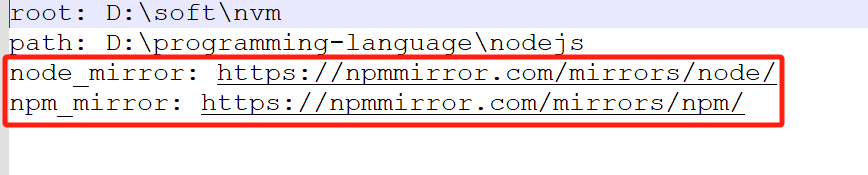
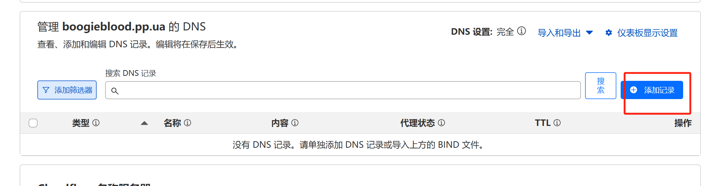
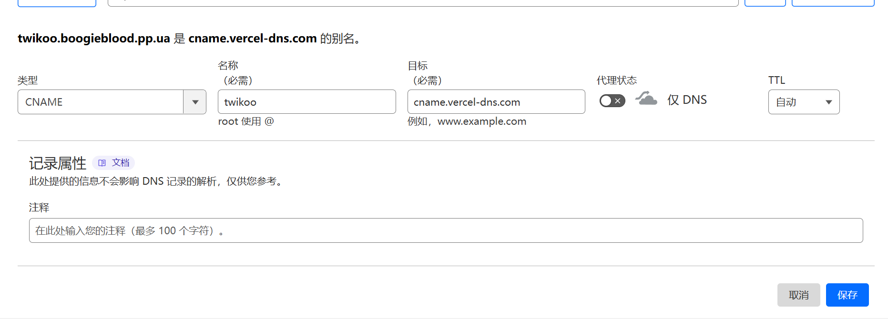

# 前言


此文章介绍搭建的过程，其中某些安装步骤可能不会那么详细，如果有不明确的地方可以留言我在做补充，整体需要用到的平台和技术都是比较主流的，并且市面上的相关文章也有很多。

这篇文章有引用到[L站大佬的文章](https://linux.do/t/topic/298986)，但不是完全一样，大佬是通过CF平台提供的`Works 和 Pages`做的部署，我觉得Vercel更方便点就没有用这部分的内容，剩下的是我自己摸索出来的办法，最后特别感谢大佬。

顺便叠个甲，本人第一次写文章发布，以前都是写给自己的，如有技术上，名词有误差欢迎指出，误差很大的就轻点喷。
 /(ㄒoㄒ)/~~


| <div style="width:100px;">技术栈或平台</div>     | 备注                                                              |
| ---------- | --------------------------------------------------------------- |
| pp.ua      | 一家乌克兰域名网站，可以通过Telegame申请到免费的域名，一个TG号可以申请三个域名。                   |
| Cloudflare | 简称CF一个域名代理服务器，可以通过托管你的域名实现对DNS的灵活配置和代理                          |
| Vercel     | 提供了极简的部署流程，需要注意Vercel只能部署静态网站，无法启动涉及到服务端的服务                     |
| HEXO       | 一个前端博客框架基于Node.js                                               |
| GitHub     | Git说牛逼点就是分布式版本管理器，说简单点就是控制代码、文本等项目管理提交器，GitHub就是提供全球开发者的远程仓库存储。 |
| Twikoo     | 一个搭建免费，部署简单，功能丰富的简洁、安全、易用的静态网站评论系统                              |
# 准备的工具


这部分标题检查是否都已经准备好了，<font color="#d83931">注意留一下最后一项邮箱</font>，如果都准备好了就可以跳到[下一章节](#pp.ua)


~~~
- VPN - 准备一个梯子有一些平台国内访问不了例如：Vercel，后面的步骤都建议挂梯子执行
- Google - 用作可视化检查你的页面情况
- Nodepad++ - 有一些文本编辑需要单独使用
- Node - 下载Node语言，用来本地启动后面的HEXO服务
- VsCode - 代码编辑器后续需要把HEXO项目拉到本地，也支持后续自己做定制化改动
- Git - 提前把Git服务准备好后续做代码拉取或者提交
- Visa - 一个跨境信用卡可以申请招商银行或者其他银行也可以
- 邮箱 - 用来做多方平台注册，我用的QQ邮箱我用到的所有国外平台都支持，也可以使用谷歌邮箱、或者Proton都可以能接收码值、跳转验证链接都可以
~~~

## VPN


VPN可以使用市面已有的软件，我本人在用的[Clash](https://portal.shadowsocks.nz/)，或者用[魔戒](https://mojie.app/)都可以，也可以用自建的vpn。
后续操作建议在开启VPN下执行


## Google浏览器

### 本机浏览器登录

地址: [**Google Chrome *网络浏览器***](https://www.google.com/intl/zh-CN/chrome/)


### 检查本机版本

检查你的本机版本，滑动页面到底部


### 点击下载Chrome


### 其他


留意一下保存路径即可，最后安装好Google浏览器，可以把谷歌帐号一起注册了不过这部分可以不操作，如果有需要的在操作即可，相关操作文章[**注册谷歌账号教程**](https://blog.csdn.net/qq_58648235/article/details/130765585)


## Nodepad++

1. 前往[NodePad官网](https://notepad-plus-plus.org/)

---

2. 点击Download

---

3. 选择一个版本进入

---

4. 往下滑动根据自己的本机版本选择不同的版本下载，建议选择压缩包直接解压了就能用

---
## NODE


这里我建议使用NVM进行安装，这样方便修改node的版本，NVM本质还是一个针对Node.js版本管理工具，后续调整版本也方便，避免了重新卸载配置环境变量的烦恼。


### 卸载Node

***如果有旧版本的NODE就卸载了，这里以WINDOWS为例***

 - Win菜单中找到Node.js的卸载程序，运行卸载程序。或者找到你本地安装的Node目录下有一个uninstall信息的文件执行即可。


- 删除环境变量
~~~
为了确保彻底删除node，看下node安装目录中还有没有node文件夹，有的话一起删除。  
删除以下文件夹（如果存在的话）  
C:\Program Files (x86)\Nodejs  
C:\Program Files\Nodejs  
C:\Users{User}\AppData\Roaming\npm  
C:\Users{User}\AppData\Roaming\npm-cache  
删除C:\Users\用户名 下的 .npmrc文件以及 .yarnrc 文件  
环境变量中npm、node的所有相关统统删掉
~~~

### NVM下载

[官方下载NVM包](https://github.com/coreybutler/nvm-windows/releases)


### 安装NVM

按照界面操作，设置程序安装位置，和设置node包位置. 下一步 完成.

### 配置路径和下载镜像

安装完nvm后先不要着急安装node版本。

找到nvm安装路径 ->找到 `setting.txt` 文件 -> 新增两行信息，配置下载源

```javascript
node_mirror: https://npmmirror.com/mirrors/node/
npm_mirror: https://npmmirror.com/mirrors/npm/
```


用`Nodepad++`打开`setting.txt`增加后如下，然后保存退出。



注意：因为淘宝的镜像域名更换，由于 npm.taobao.org 域名HTTPS证书到期更换为 npmmirror.com，那么就会导致之前使用该镜像域名下载依赖的安装包会出现问题。
执行报错信息如下：
nvm ls available
Could not retrieve https://npm.taobao.org/mirrors/node/index.json.
Get "https://npm.taobao.org/mirrors/node/index.json": x509: certificate has expired or is not yet valid:


### 验证NVM

win + R，调用cmd，输入<font color="#d83931">nvm</font>，出现下面这一堆就表示安装成功了。



如果安装不成功，查看之前自己安装的 node.js 有没有彻底删除、安装nvm过程中有没有漏掉什么，可重新卸载再安装一次nvm包。


### 使用NVM安装Node


win + R，调用cmd
安装完成后开始插入nodejs首先使用 <font color="#d83931">nvm list available</font> 查询可插入版本号，LST表示可插入稳定版本。【如未指定版本，建议安装LTS下的版本】



~~~javascript
1. 安装指定node.js版本: `nvm install 18.12.0`
2. nvm use 切换node版本。(如果报错，用管理员身份打开重新 nvm use 你指定的版本）: `nvm use 18.12.0`
3. 安装完成后可以分别输入命令行 `node -v` 和 `npm -v`，检验node.js以及对应npm是否安装成功
4. `nvm list` 查看当前已安装的node.js版本，带*号的是正在使用
5. 删除某node.js版本 ：`nvm uninstall node版本号` // 例如：nvm uninstall 16.14.0）即可删除对应版本
~~~


## VsCode

### 下载VsCode

[VsCode官网](https://code.visualstudio.com/)，点击Download


选择自己本机的版本下载

### 安装VsCode


安装步骤按默认就行，目录自己选择要的目录即可，注意选择附加任务的第四点框选要去掉，注意下图



### 下载VsCode扩展


下载这三个扩展，分别是：
1. Chinese (Simplified) (简体中文) Language Pack for Visual Studio Code
2. Git History
3. GitLens — Git supercharged



## Git

### 下载安装


下载安装步骤提供一个链接[Git教程](https://www.runoob.com/git/git-install-setup.html)，按照这个步骤执行即可
Git的安装不需要太繁琐的配置，建议下载压缩包tar.gz类型，解压之后只需要配置环境变量指向你的目录就可以了。
至于要配什么链接我建议是基于项目去配置，包括用户名、邮箱之类的。
针对windows用户多加一个设置，[配置右键GitBash](https://www.cnblogs.com/VueDi/p/15548816.html)



现在市面上Git平台有GitHub、Gitee、GitLab等等，我的建议是如果是开发人员基于这个项目不要轻易使用全局命令因为一旦使用全局命令，你之前的git信息就会被更改，再回到你其他的项目做git操作会发现你的提交信息(用户名)发生变化或者提交不上去。
尽量一个项目一个隔离的git操作命令，例如更改用户名: `git config user.name`这类的命令，不要轻易携带<font color="#d83931">--global</font>



# <h2 id="pp.ua">pp.ua</h2>


现在涉及到免费的域名有很多，但是需要留意的是免费的域名可能没准那天会出现问题包括访问问题、平台跑路等等，造成的损失会比收费的成本更高，所以免费的才是最贵的，下面是列举的免费的域名


| 域名         | 地址                           | 备注                                                                                                                                                                                                             |
| ---------- | ---------------------------- | -------------------------------------------------------------------------------------------------------------------------------------------------------------------------------------------------------------- |
| us.kg      | https://register.us.kg       | 支持CF托管，但是现在注册已经拦截不让国内的人用了，而且注册会一直卡在上传认证一直提示你上传的内容是空无法识别，我实在没办法就放弃了。[具体操作教程](https://zhuanlan.zhihu.com/p/717055484)                                                                                            |
| com.mp     | https://www.registry.com.mp/ | 没有试过                                                                                                                                                                                                           |
| pride.moe  | https://registry.openhost.uk | 没有试过                                                                                                                                                                                                           |
| coms.ng    | https://www.azote.be/        | 没有试过                                                                                                                                                                                                           |
| coms.ee    | https://coms.su              | 没有试过，据有人说已经停止注册了                                                                                                                                                                                               |
| coms.hk    | http://www.3domains.net/     | 没有试过                                                                                                                                                                                                           |
| eu.org     | https://nic.eu.org/          | 欧洲的一个免费域名，而且很多年了貌似1996年开始创立的，支持CF托管，注册很方便，认证也很方便，但是申请域名非常TMD的久，根本等不到，如果等到了那这辈子就有了。[具体操作教程](https://www.cnblogs.com/newchat/articles/17436601.html)                                                             |
| nom.za     | https://secure.nom.za/       | 没有试过，支持CF托管                                                                                                                                                                                                    |
| ggff.net   | www.l53.net                  | 没有试过，据有人说已经停止注册了                                                                                                                                                                                               |
| pp.ua      | https://nic.ua/              | 我使用的是这个域名，支持CF托管，注册认证申请流程很简单，域名到手很快                                                                                                                                                                            |
| asso.st    | http://azote.org/            | 没有试过，但是这个域名是模仿的上面pp.ua的模式，但是限制法国IP注册                                                                                                                                                                           |
| us.to      | http://freedns.afraid.org/   | 没有试过，支持CF，但是说很方便而且域名选择也很多                                                                                                                                                                                      |
| cloudns.be | www.cloudns.net              | 这个域名我也申请下来了，注册认证申请也相当方便，而且也支持CF托管，但是我后面会提到这个域名<font color="#548dd4">坑爹</font>的地方，包括他和CF之间的托管的机制，整个就是一个<font color="#548dd4">大傻逼</font>，另外这个域名如果要CF托管是需要双向解析的，这点不是很友好。[大佬的详解](https://linux.do/t/topic/273812)。 |
| vu.cx      | www.venez.fr                 | 没有试过，域名选择有很多，但是也限制法国ip注册                                                                                                                                                                                       |
| dedyn.io   | http://dedyn.io/             | 没有试过，已经停止注册，支持CF托管                                                                                                                                                                                             |
## 准备内容


QQ邮箱、TG账号、Visa信用卡

## 注册

在谷歌浏览器进入[pp.ua](https://nic.ua/)平台，点击`Sign in`


在弹窗界面点击`Sign up`注册一个账号


填写下面的信息点击`Sign in`


之后在你的邮箱收到一份验证邮件，点击`Confirm your e-mail`


跳转之后看到这个界面就是已经注册成功


点击上面`Domains`


输入自己的域名，格式: <font color="#92d050">`xxx.pp.ua`</font>，然后回车搜索


如果出现这行提示证明有人使用了就再换一个二级域名的定义


看到这个提示就证明可用域名就可以加入购物车，因为是免费(Free)所以不会有什么金额消耗

点击右边的`Checkout`


最后点击`Continue`


这里填写个人信息，但是***<font color="#d83931">注意</font>***
这里除了我图片说的要填写，其他信息都不要填写个人的真实信息



内容可以用这份，名字什么的都可以自己定


点击`Continue`下一步


这样看到我们的域名就发出了，之后点击`Go to my orders`

之后点击域名左侧第二栏，会看到一个`需要卡片激活`，因为这个域名网站需要绑定Visa信用卡，做一下验证。


录入一个visa卡，进入到一个新页面


录入visa卡的信息


之后通过TG去激活你的域名，回到刚刚的`Domains`，跳到另一个新页面


进入到这个页面，往下滑动找到ppuabot的电报机器人地址


点击跳到本地的TG服务上，或者复制下来在你的手机上打开也可以，[ppuabot](https://telegram.me/ppuabot)

点击启动

点击菜单处，点击`start`


之后点击发送你的手机号，记住是你的TG手机号，也就是前面你自己在域名平台提交的手机号


看得到这条回复就可以了


后面点击下面的激活域名，之后复制你的域名，到聊天窗口输入回车


看到下面这两条回复就是正常的


点击这个红色窗口，跳转一个验证页面，[验证地址](https://pp.ua/rus/policy.html)


点击中间的绿色文本

点击第一个链接


输入下面这些内容

验证码就是回到TG聊天窗口，下面有一个`YES`，点击获取一个验证码


看到这个回复的码值复制过去即可


之后点击下面的按钮


出现这个提示就是成功了


之后回到nic.ua你的域名管理平台，看到域名前面变成绿点就可以正常使用了。

# Cloudflare


[Cloudflare](https://dash.cloudflare.com/)平台一个域名解析管理平台，能做的事情很多包括基础的DNS配置，还有CDN的设置包括一些安全性的验证都可以在CF平台进行处理。


## 注册

进入页面，点击注册

设置你的邮箱和登录密码

之后去你的邮箱获取验证地址，跳转一下后续配置一些信息就可以登录CF平台了。

## 配置PP.UA

登录进入平台，点击右上角的添加按钮，点击现有域


输入你的域名，选择第一项快速扫描，点击继续


滑倒最下面选择免费`FREE`，点击继续

出现这个页面，滑倒下面


全选已经配置的DNS，全部删除


点击继续激活


继续点击确认


之后滑倒下面，复制这两个NS地址

前往nic.ua地址，到你的域名列表，点击右侧的设置按钮

滑到下面看到`NS-serves`，选择自定义`name server`

点击`Change`

将两行的记录换成前面在CF平台复制的NS地址，点击`Save`

之后回到CF平台点击继续

跟进CF这个状态，过一会就可以


看到这个页面CF就成功托管你的域名了


# GitHub


在你的GitHub上创建几个项目，由于这是我本人的操作方式，至于创建几个可以自己控制，不一定要创建这么多项目，因为我比较喜欢分清楚有地方记录。


## 网站框架的整体文件项目

```
这个项目是在初始化下载安装HEXO项目时，HEXO提供的源码文件目录，这里还会包括你更换的主题项目也会在这个项目里，用来做打包、部署、启动、停止等，因为会涉及更改主题，或者更改你的Git提交地址链接，或者是一些配置文件的定制化改动，这个源码项目是不会提交到一个线上Git的，所以你可以改完不提交，只是做打包部署，但是后面一旦换了本机或者误删就找不回了，所以我建议还是把整体源码项目提交到一个你能线上看到的地方。
```
## HEXO打包的前端文件项目

```
由于涉及到HEXO框架部署，会自动帮你打包项目提交到你定义好的Git地址，所以这部分是必须要设置的，后面做Vercel部署也需要你定义的这个项目，所以这个项目是一个基于HEXO打包生成的一个纯前端的项目。
```
## 博客文章项目

```
专门定义一个你写文章的项目，后续关于怎么写项目用Git提交并且触发HEXO打包部署提交Git的一套流程我会出一篇文章描述。
```
## Twikoo评论项目

```
这个项目用来继承Twikoo(https://github.com/twikoojs/twikoo)项目，因为Twikoo 是一个基于Vercel的轻量级评论系统，它通过Vercel的无服务器函数（Serverless Functions）来实现评论功能。，你只需要关心设置一个MongoDB数据库地址和部署你的博客项目引入这个Twikoo的评论系统。
```
# HEXO


流程在本地下载安装一个HEXO的源码服务，有点类似下一个Node.js的流程，这个服务可以启动在本地看到一个HEXO初始化页面，但是是没有任何样式都是普通的初始化样式，然后HEXO官方提供一个对接主题的配置文件，想要什么主题样式更换配置文件就可以加载了，因为HEXO官方会自动去下载对应的主题Git项目，重新加载成HEXO可识别的页面展示，并且HEXO还挺提供了一个链接你的Git项目地址，这样每次提交Git会自动打包成一个前端的项目，把所有的前端文件提交到你的Git项目中。


## 下载安装HEXO

1. 新建一个文件夹
2. 打开控制台命令行，下面这两个其中一个都可以，或者在代码编辑器中找到终端窗口也可以。

3. 执行命令
```shell
npm install -g hexo-cli && hexo -v
```
4. 出现下面的输出就正常了


## 验证HEXO

命令验证hexo，检查输出是否正确
```shell
hexo -v
```


## 初始化HEXO

初始化需要执行三行命令，检查输出是否正常
```shell
hexo init blog-demo
cd blog-demo
npm i
```

## 打包启动HEXO


初始化完成后，查看目录是否正常
- **node_modules**：依赖包
- **scaffolds**：生成文章的一些模板
- **source**：用来存放文章
- **themes**：主题
- **_config.landscape.yml**：主题的配置文件
- **_config.yml**：博客的配置文件
- **package.json**：项目名称、描述、版本、运行和开发等信息



执行命令`hexo cl && hexo s`启动项目，检查输出成功之后，就可以在浏览器输入localhost:4000查看你的页面了


## 绑定Git地址


***建议使用VsCode做后面的修改***


打开HEXO的项目找到`_config.yml`，修改`deploy`下的Git地址，这个Git地址就是前面提供给HEXO打包生成的前端文件项目的地址


## 安装插件hexo-deployer-git

```shell
npm install hexo-deployer-git --save
```


## 打包提交Git

最后检查输出出现 **Deploy done**，则说明部署成功了，验证可以前往GitHub看看你的项目是否出现提交点
```shell
hexo cl; hexo g; hexo d
```


## HEXO常用命令

| 命令                                       | 描述                      |
| ---------------------------------------- | ----------------------- |
| `hexo new [layout] <title>`              | 创建一篇新的文章                |
| `hexo generate` 或 `hexo g`               | 生成静态文件                  |
| `hexo server` 或 `hexo s`                 | 启动本地服务器                 |
| `hexo deploy` 或 `hexo d`                 | 部署网站                    |
| `hexo clean`                             | 清除缓存文件和已生成的静态文件         |
| `hexo clean; hexo server`                | 清除缓存并启动本地服务器查看最新效果      |
| `hexo clean; hexo generate; hexo deploy` | 清除缓存后生成新文件并把内容发布到自己的服务器 |
## HEXO主题


我推荐使用安知鱼主题，或者别的主题也可以，这个看个人审美吧，具体安知鱼主题的文章我也会单独出一篇。
下面的篇幅对安知鱼主题的初始化加载。


### 下载安知鱼Git项目

终端输入命令
```shell
git clone -b main https://github.com/anzhiyu-c/hexo-theme-anzhiyu.git themes/anzhiyu
```

### 加载安知鱼主题

将HEXO下的`_config.yml`内置的主题修改为`anzhiyu`


安装 pug 和 stylus 渲染插件
```shell
npm install hexo-renderer-pug hexo-renderer-stylus --save --registry=http://registry.npmmirror.com
```
### 调整配置文件

`themes\anzhiyu\_config.yml`的配置文件修改后缀做备份，改为`_config.yml.bak`，然后把这个备份的文件移动到和HEXO的配置文件同级，将文件名改为`_config.anzhiyu.yml`。


**注意：**
- `_config.anzhiyu.yml` 中的配置优先级最高，修改原 `_config.yml` 无效。
- 每次更新主题，可能存在配置变更，请注意更新说明，可能需要手动对 `_config.anzhiyu.yml` 同步修改。
- 可以使用 `hexo g --debug` 查看命令行输出，确认配置是否生效。
- 如果想将某些配置覆盖为空，注意不要把主键删掉。


### 重新启动

重启后查看页面效果如图就加载成功了
```shell
# 本地预览
hexo cl; hexo g; hexo s

# 推送更新上线
hexo cl; hexo g; hexo d
```

# Twikoo

## 申请MongoDB账号

[MongoDB注册](https://www.mongodb.com/cloud/atlas/register)，填写的信息按照这个就可以。

去到邮箱验证你的账号

填写问卷

## 选择免费套餐
选择免费套餐，云服务商选择 aws，地区选择 N. Virginia (us-east-1)。

接下来会得到一个用户名和密码，先复制一份保存，等下会用到。

## 创建数据库用户
在 Database Access 页面点击 Add New Database User 创建数据库用户。


Authentication Method 选 Password，在 Password Authentication 下设置数据库用户名，点击 Autogenerate Secure Password 生成密码并复制密码，选择 Atlas Admin，最后点击 Add User。


## 新增网络ip地址
在 Network Access 页面点击 Add IP Address，点击 ALLOW ACCESS FROM ANYWHERE，点击 Confirm。


## 获取数据库地址
在 Database 页面点击 Connect，连接方式选择 Drivers。注意选择是DATABASE下的，每个人分配到的数据库名称不一样。

复制如下数据库连接字符串，将连接字符串中的 `<username>:<password>` 修改为刚刚创建的数据库 `用户名:密码`，<> 不要保留。


## 可视化工具查看

用Robot 3T工具可以连接数据库连接地址，复制上面的地址，修改用户名和密码

打开`Robot 3T`点击`create`

选择`Replica Set`

删除本地的地址

复制地址到输入框，之后点击左侧的`From SRV`

最后点击下面的`Test`测连接

出现这个提示就可以查看表信息了

效果如下

## HEXO博客加载Twikoo服务


# Vercel


这里注册[Vercel](https://vercel.com/)，就不做记录了，主要是绑定你的GitHub的账号。
Vercel 是一个现代化的云平台，专注于前端开发和无服务器架构。它主要用于托管和部署静态网站、单页应用（SPA）以及基于 Next.js 的应用程序。
<font color="#ff0000">注意：</font>
	由于Vercel提供的域名是不能在国内访问的，需要开梯子。


## 部署HEXO博客网站

点击右上角的头像

点击`Add New`按钮

选择`project`

选择你HEXO打包生成的前端项目Git，点击`Import`

可以选择修改你的Vercel项目的名称，不改名字的话直接点击下面的`Deploy`

部署需要一些时间，部署完成之后进入这个页面看到这个`Ready`就算部署成功了，点击左侧的图片可以直接跳到你的项目。


### 配置博客域名

点击`Settings`


点击下方的`Domain`，再点击右边的`Add`


填写你的域名，这里填写你前面申请到的pp.ua域名，我建议在你的三级域名定义成blog方便区分，例如：`blog.xxx.pp.ua`

填写完之后，点击下面的`Add Domain`

点击下面的按钮，上面的按钮会帮你直接跳转到CF平台，但是不建议这么做，有些第一次注册的域名会失效。

复制这行`CNAME`信息去CF进行DNS配置

前往CF平台，点击你配置的域名

点击左侧的DNS

点击添加记录

选择CNAME类型，名称和IPv4地址填写Vercel提供的信息，注意Vercel提供的IPv4地址最后的小数点不要复制，最后把小黄云关闭，不要走CF自己的CDN这样国内访问的时候很会慢，最后点击保存。

看到这行记录就算成功

最后回到Vercel你项目的控制台就会看到域名生效了，就可以用你自己的域名访问了。

## 部署Twikoo静态评论服务

点击 [Twikoo-Vercel部署链接](https://vercel.com/import/project?template=https://github.com/twikoojs/twikoo/tree/main/src/server/vercel-min)，填入项目名字，点击 Create。

创建需要点时间，点击 Continue to Dashboard。

点击`Setting`

点击 Domains，设置自定义域名。

操作跟前面一致

复制信息前往CF托管。

CF配置

Vercel配置的域名生效

配置环境变量并调试配置，找到 `Environment Variables`，添加环境变量 `MONGODB_URI`，值为前面记录的数据库连接字符串。

配置MongoDB地址之后点击`Save`

找到 `Deployment Protection`，设置 `Vercel Authentication` 为 `Disabled`，然后点击 `Save`。

找到 `Function`，将 `Function Region` 修改为你需要的地区。这个感觉选哪个都行我最后选的亚洲香港。


保存完之后，重新部署


回到控制台，看到这个就算成功

### 配置HEXO博客评论文件

在你本地的HEXO项目中找到你自己定义的配置文件`_config.anzhiyu.yml`，`Ctrl F`搜索`twikoo`，配置你在Vercel上配置的Twikoo评论项目的域名

在这个文件在搜索`comments`找到这个配置，修改成我这个配置就可以

最后重新在你本地部署一遍，进入到一个文章中，滑倒最下面看到效果这样就可以了。


## Vercel坑爹的地方


由于早期我没有好好调研Vercel部署配置域名这部分的内容，早期我选择的域名是ClouDNS的域名，因为也是免费的就没想那么多，域名如下。




但是你们发现没有这个clouDNS提供的一级域名是携带<font color="#ff0000">中划线</font>的，这就导致Vercel在做域名识别的时候会自动把你输入的域名进行切割，至于切割的规则我不太清楚，但是你回到DNS配置是无法配置出这个域名的，因为完全不匹配，就像下面这种情况。



点击Add提交之后，变成这样子了。你完全不能配出`_vercel.ddns-ip.net`这个`_vercel`部分的信息。


后面排查半天也不知道是什么原因导致的，按理来说这个域名应该是一个三级域名，而Vercel直接把你自己的二级域名给去掉了就是`freefunk`这部分的信息去掉了，后面去Vercel社区查了好多人都出现这个问题不约而同都是一级域名中<font color="#ff0000">携带中划线</font>，然后官方的说法是换个域名，我真的是草了，浪费我好久的时间。


