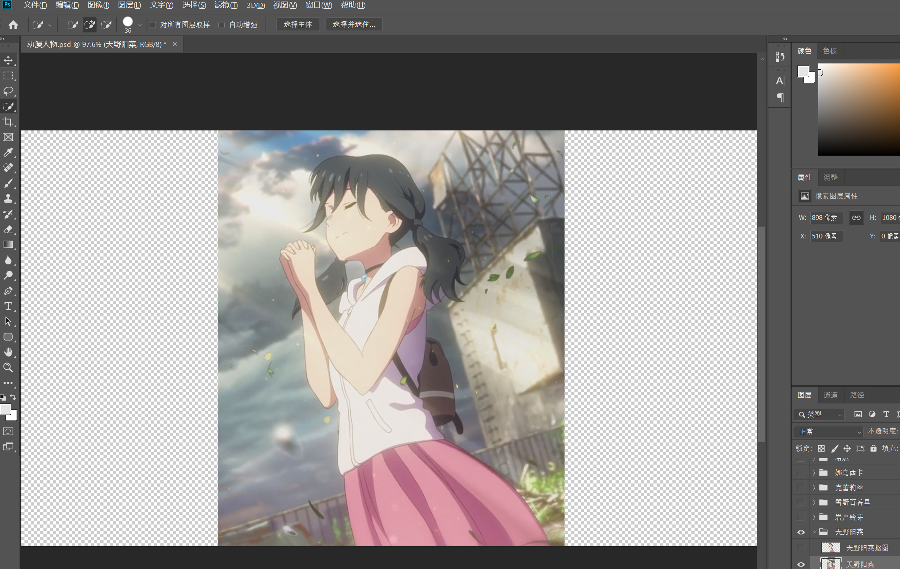
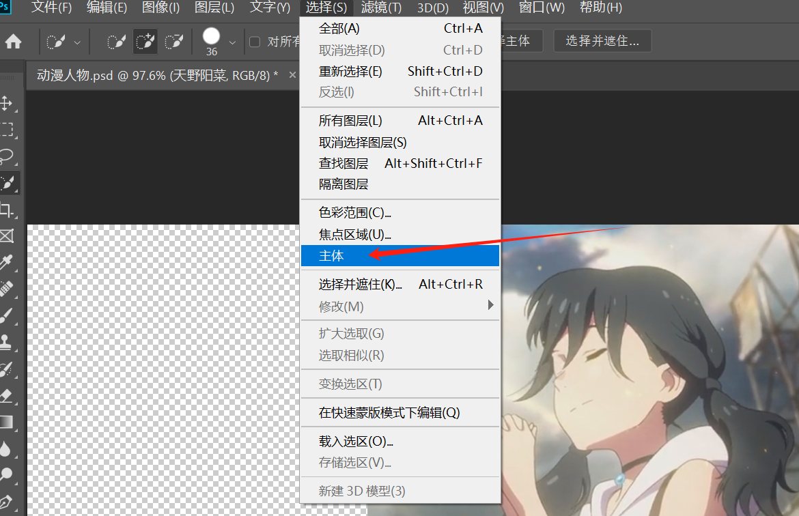
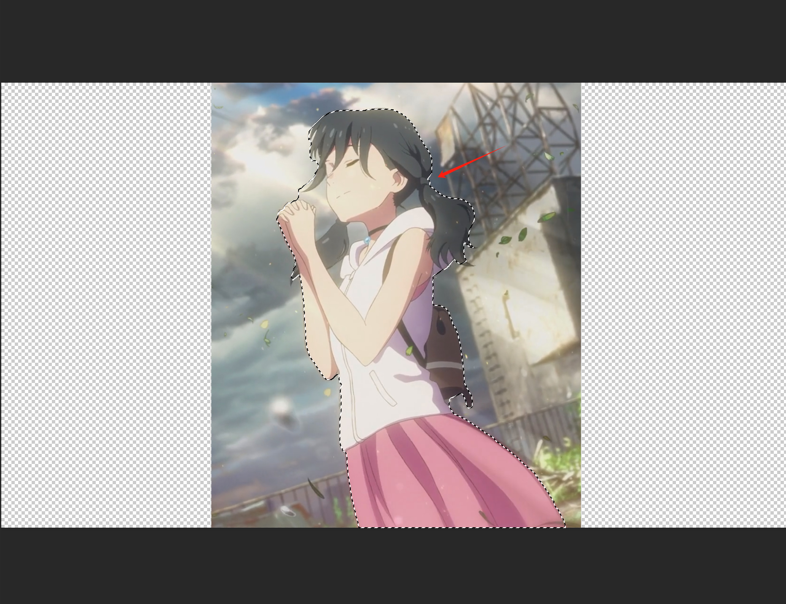
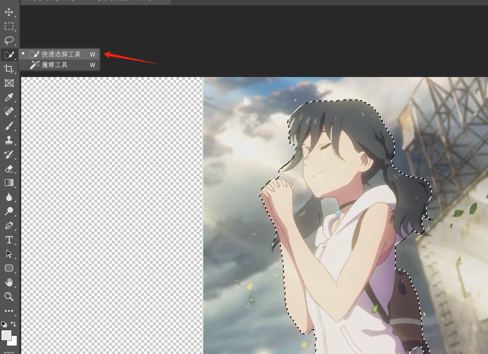
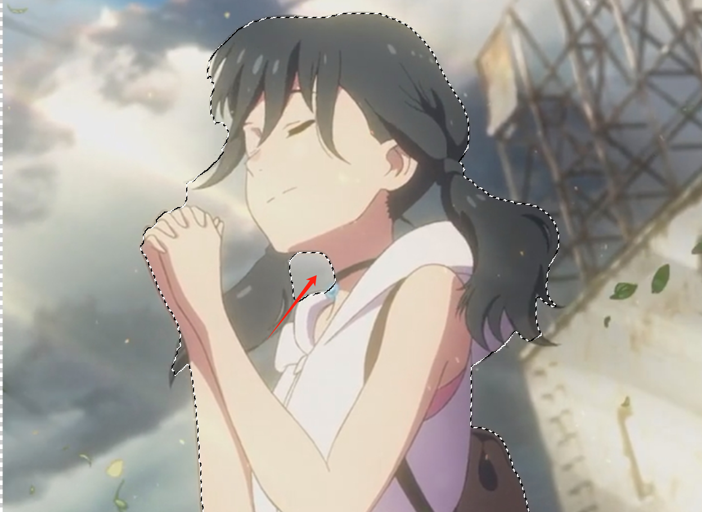
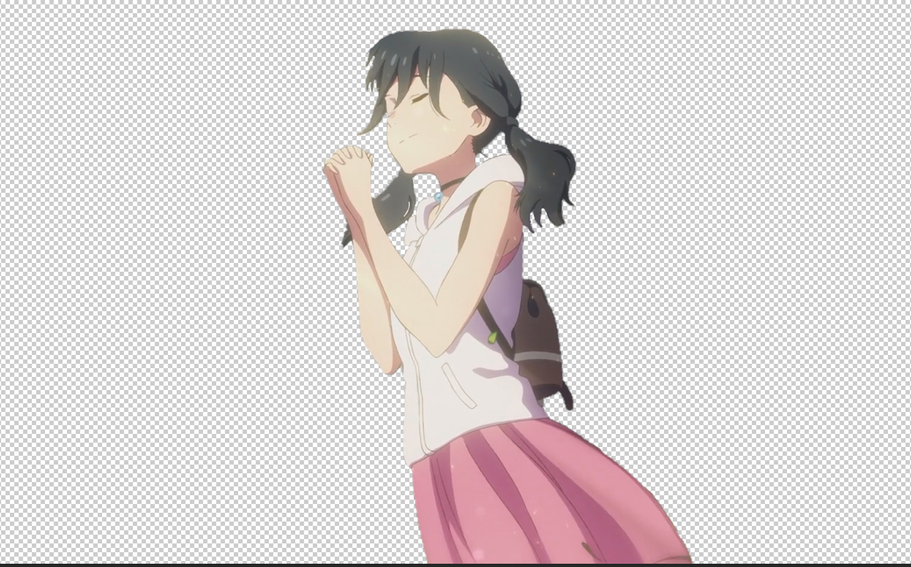
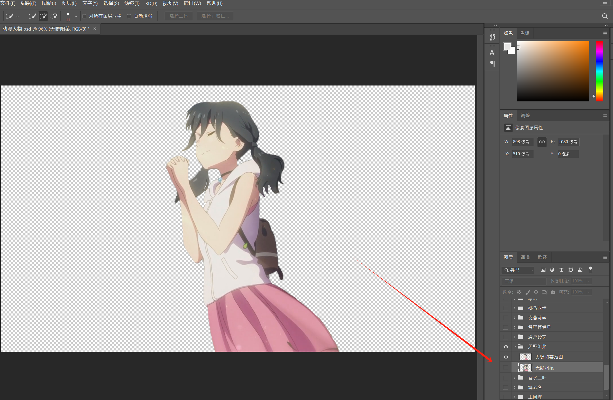

# 前言


抠图的办法有很多，包括`钢笔工具`，`快速选择工具`，`魔棒工具`，包括使用`通道`去做抠图，其实本质就是要区分人物和背景的图像，要把你想要的部分利用选区框选留下来，所以现在市面上有些`AI`去做抠图，其实效果不是很好，因为模型不能代替人的需求，人本身的业务需求比较复杂，利用模型去做还是非常困难的，除非搭建一个完整的知识库体系，只理解你一个人的图形需求还是可以只不过这样的成本太大了，不适合个人。


# 快速抠图

打开`PS` 我这里用的是2019版本

点击上面操作项`选择`，下面的`主体`

等一会你的图像就会出现一个框选线

这个时候选择左侧栏的`快速选择工具`

- 图片快速放大缩小快捷键：按住 + 鼠标滑轮
- 光标快速变大变小：按住 + 鼠标右键按住左右滑动鼠标
- 框选删减：按住 + 鼠标左键

如果框选效果还不错的话，快捷键  +  快速复制一个图层出来。


***需要注意你在选择用这个主体快速确定选取抠图的方式一定要在你的图层选择上进行操作，如果没有选中你的图层，这个主体选项是灰色按不了的。就像下面这个情况一样，你的图层选中的是下面的，但是窗口显示的是上面那个图层，这样主体的选项是用不了的，你要选中上面的图层可以。***



# 总结

default 
抠图的场景也有很多，包括毛发丝很多的人物、复杂背景的人物(人来人往的场景、周围图像很多，色彩复杂的)等等，都有不同的抠图方式，取决图片本身的情况，以图片为准去做相关的抠图方式，所以在`PS`对图片做的处理没有绝对的方法，只有最适合这张图片和自己想要的效果，两者结合得出一个完整的处理方式，这个我认为才是最好的图像处理思路。
